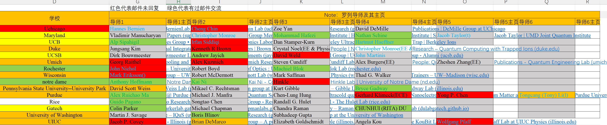
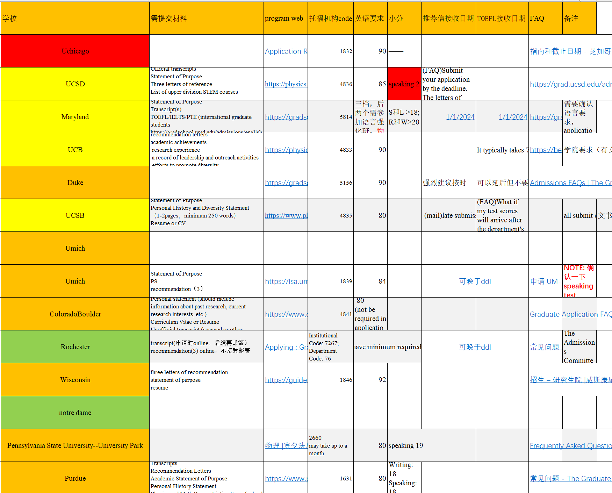

# \[US\]20-冯鑫钰-University of Michigan, Ann Arbor-Physics

## 基本背景

> 三维(截至申请时): GPA 3.91/4, ranking: 2/63;
>
> TOEFL: 101\(Speaking 19\);
>
> GRE: none
>
> 联系方式：fengxy@umich.edu

## 科研经历

1. 从2021年底到毕业前均在量子院贺煜老师课题组，无论文
2. 竞赛若干，但没什么用
3. 推荐信构成：两封科研推，一封课程推。科研推一封来自老板，一封来自合作的理论老师；课程推老师私交甚好，并且我在他的两门研究生课程中均取得最好成绩

## 申请结果

最终录取学校：University of Michigan, Ann Arbor

其他录取结果：

- **Offer\(6\):**
  - \[Physics PhD @ Purdue\]
  - \[Physics PhD @ Rochester\]
  - \[Physics PhD @ Gatech\]
  - \[Physics PhD @ HKUST\]
  - \[ECE PhD @ University of Notre Dame\]
- **Rej\(10\)**:
  - \[Physics PhD @ Berkeley, UChicago, Duke, Rice, Wisconsin Madison, UWashington, Penn State, UMD, UCSB, UIUC\]

## 申请心得

### 1. 明确目的（写在最前面，这一点我认为是在迈入人生新阶段要仔细思考的问题）

虽然一个人的追求可能会随着阅历的增加而发生变化，但是我还是要说的是，在申请美国博士的那一刻，一定要非常明确自己为什么要读*美国博士*。接下来我将从以下几个角度提供些许思考。

#### 1.1 为什么要读博士

是出于对物理科研的浓厚兴趣，未来想要在学术界继续钻研？还是因为想要博士这么一个学位，然后更好找工作？如果是前者，无可厚非，博士是必经之路。如果是后者，那么就需要仔细衡量一下自己未来的工作类型（是研发类还是设计类等）是否真的需要博士的训练，以及需要评估在未来的五年里，你从博士学习期间得到的锻炼和去工作得到的经验和资历能够相比吗？

#### 1.2 为什么要到美国读博士

首先先根据我自身感受对比一下中美的大致情况：

- 美国的去中心化程度比国内更高：中国更有集中力量办大事的科研风格，因此就研究经费而言：国内的特定领域和组（国家重点发展的领域，可以参考十四五发展纲要等文件）> 美国的特定领域和组。其余的研究领域和组的科研经费则是国内方差更大
- 研究自由程度：美国 > 国内。在国内有很多课题因为缺乏应用价值而很少有经费投入其中，但是美国就会有不少，也因此，在美国也许能够实现自己的某些研究想法以及获得更加宽广的学术视野。
- 美国比国内更需要自律和自我规划。首先，美国老板如果过了tenure，会更容易躺平，并且在美国的博士和导师之间的关系更像是合作者，老师并不会为学生负责。因此学生会更加的自由，拥有更多的自由时间，甚至早上10点到实验室，晚上5点就回家。这在国内几乎不可能。其次，美国的组普遍较小，一般能够做到两个人一个课题，甚至一个人一个课题，因此就更容易遇到困难就摆烂。如果因为自由而摆烂躺平，加之美国博士没有要求发多少篇论文才能毕业的要求，那么可能整个博士都有可能变为浪费时间。
- 美国的博士文章普遍不如国内同等水平的组：国内项目的参与者更多，有时候甚至能够发展为类似流水线的研究模式。这种模式的论文产出的效率很高，但是对于培养博士来说，并不见得是一个好方式。
- 美国博士在国内积攒人脉比国内博士更加困难：这一点很容易理解，如果想要在国内发展，能够有一个大腿抱，有自己的人脉网，一定是比没有要好很多的。国内博士则会比美国博士更容易积攒起这些资源，最起码自己的导师就是很好的资源（这里并不是说学术拜山头的意思，但也不得不思考现实的问题）。

### 2. 分析自身情况

- 科研经历是否突出
  - 首要表现在是否有文章发表需要注意的是文章最好是一作。如果是非一作，那么文章可能仅会被认为是有过科研经历的证明（有过科研经历当然也非常重要）
  - 其次是带你做科研的导师是否能给你非常强力的推荐信（最好的推荐信就是使用私人邮件等直接告诉对方，自己这里有个很厉害的学生）
- 推荐信是否强力
  - 自己能拿到哪些教授的推荐信。这些教授和自己的关系如何？可以要推荐信的教授有：自己的项目导师、自己的学术导师、某一门得了满绩或者第一名的课程认可教授、和自己私交非常好，非常熟知自己的老师等
  - 如上文所提到，推荐信一大重要作用便是证明该学生有过科研经历，如果能够告知对方该学生在该科研经历中表现非常突出，就是非常好的推荐信了
  - 第二，推荐信还能够反映出个人的综合能力，包括乐观积极的态度，不怕困难的精神等等
  - _推荐信一定要言之有物_。这一点非常重要。自己邀请的推荐人们能不能全力推荐你。全力推荐的意思是能够用非常详细的事例和比较的方式阐述你很厉害。
- 自己成绩是否突出：如果成绩非常突出，那么这也会是一个亮点.
-

### 3. 开始着手申请

在此我想要感谢我的女朋友Gxt的大力支持，她在我申请期间帮我处理众多申请事务，缓解了我申请季焦虑。

#### 3.1 时间安排

每个人的时间节点不尽相同，但是有这么几个事件是需要提早确定的。

1. 英语考试尽可能的早准备、早考试、早通过
2. 邀请写推荐信的老师一定要早联系。有些老师每年推荐的人有限，因此要早日联系。同时还需要确认推荐人能够为你提交多少封推荐信。如果存在推荐人能够为你提供的推荐信份数不够自己申请的学校数量，那么就需要提前找好额外的推荐人。
3. 在写完SOP之后预留出1-2个月的时间进行打磨
4. 套磁信可以从9月开始

#### 3.2 前期资料整理

1. 首先是筛选感兴趣的老师，这是第一步，但也非常繁琐。可以根据usnews graduate school ranking + department中的学校顺序来搜寻是否有自己感兴趣的老师。这需要首先进入对方学校的物理系官网，然后找到感兴趣的方向，接着进入里面的教授个人主页，查看研究方向以及近期发表论文（需要注意的是，研究方向可能更新不及时，因此一定要结合近期发表确定教授的研究方向）。如果有就可以记录下来，为后期选校和套磁做参考。eg：
2.
3. 接着是学校的申请要求。进入申请官网，确认学校的申请条件，包括申请截止日期（一半都是12月15日，但也有部分是12月1日、8日或者1月15日）、英语要求（最重要的是查看口语小分要求）、文书内容要求（一般而言会包括两个：SOP和PS。不同学校的SOP一般要求相对一致，但是PS则不太一样，需要仔细确认）、推荐信提交时间（有些学校要求在申请截止日期前提交，有些则可以延后）。eg：
4. 根据上面的两个因素，基本能够确认选校列表，以及自己感兴趣的教授。

#### 3.3 推荐信

如上文所言，找推荐人需要尽早，同时询问推荐人是否能给强力推荐和能够提供给你多少封推荐信。一封普普通通的推荐可能会起反作用。

在开始后。尽早将推荐信的提交邀请和相关要求整理成文档，发送给推荐人。留给他们充足的时间进行操作。

#### 3.4 SOP

SOP可以说是非常重要的书面文件了。关于格式和内容，我在此处提供两个参考链接，并不再赘述
Cornell：[Academic Statement of Purpose : Graduate School (cornell.edu)](https://gradschool.cornell.edu/admissions/prepare/statements-of-purpose/#:~:text=What%20is%20it?%20Each%20applicant%20must%20submit%20an%20academic%20statement)
MIT：[Statement of Purpose for Graduate School : Mechanical Engineering Communication Lab (mit.edu)](https://mitcommlab.mit.edu/meche/commkit/statement-of-purpose-for-graduate-school/)
补充一句：在写SOP中一定要真诚，这也是我前面提到的一定要想清楚为什么要读博士，想清楚了，SOP自然会好写很多
再补充一句：可以用AI帮忙检查语法错误和替换某些词汇，可以适度让AI帮忙润色。但是我自己的经历是，AI润色后的SOP充满着一股AI味，同时我让英语母语的老师修改，他们能够看出些端倪。在我看来最好的办法是让一个英语母语的教授帮你修改一下，他们语言更加正宗同时也非常了解招生最看重什么。

### 4. 套磁与面试

1. 套磁邮件一定要简短但重点突出，千万不要写很长，否则会进垃圾邮箱。150词左右即可。需要介绍一下自己，同时也要表示对教授的研究非常感兴趣（可以是某篇文章的方法自己很感兴趣，又或者是对方教授的研究课题自己很有想法，这些都可以在邮件中聊）
2. 在收到回信之后，主动邀约Zoom meeting
3. meeting需要自己准备一个Slides来讲述自己的研究，这个slides需要准备两个版本的，一个是5分钟的，能够简明扼要的讲清楚的，另一个是稍微长一点的20分钟左右的能够详细讨论的。

### 5. 结语

最后我想说的是，申请季是一个非常容易焦虑和自我否定的时期。但是就我看到的和听到的，南科大物理系的学生，如果绩点有3.8，有科研经历，推荐信没有被说坏话，心态积极健康，并且选校梯度合理（指选校分布在USNEWS Physics graduate school top 50），一定不会没有书牍的。
