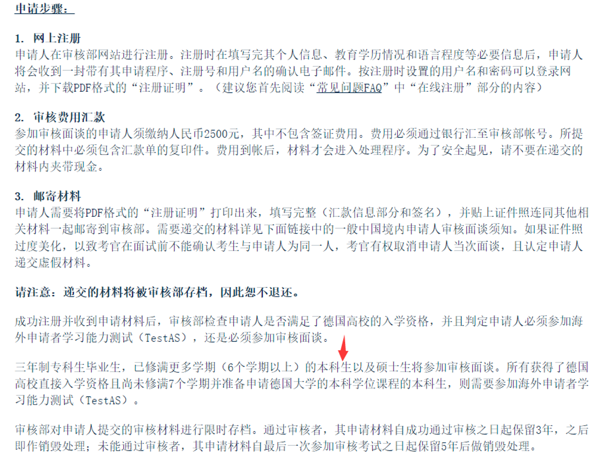
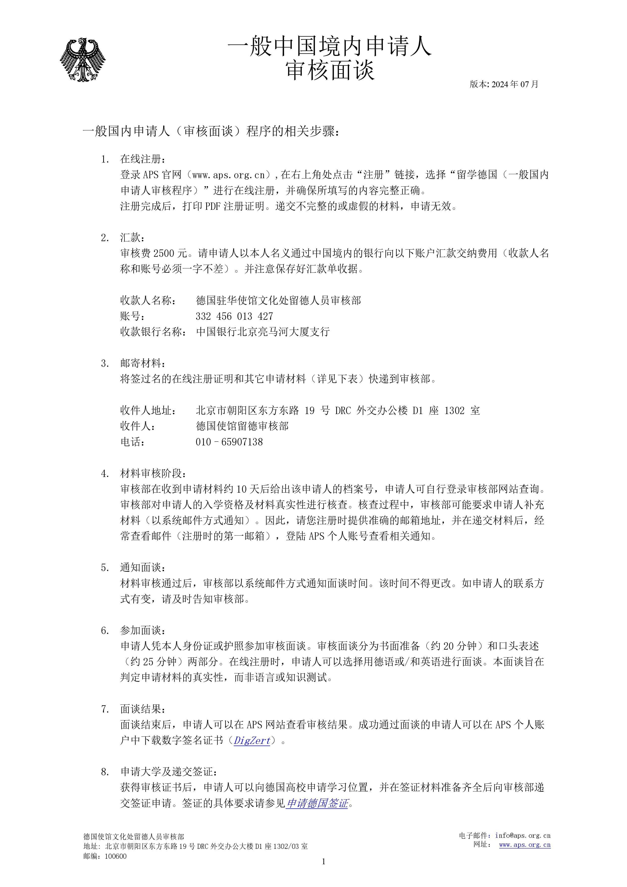
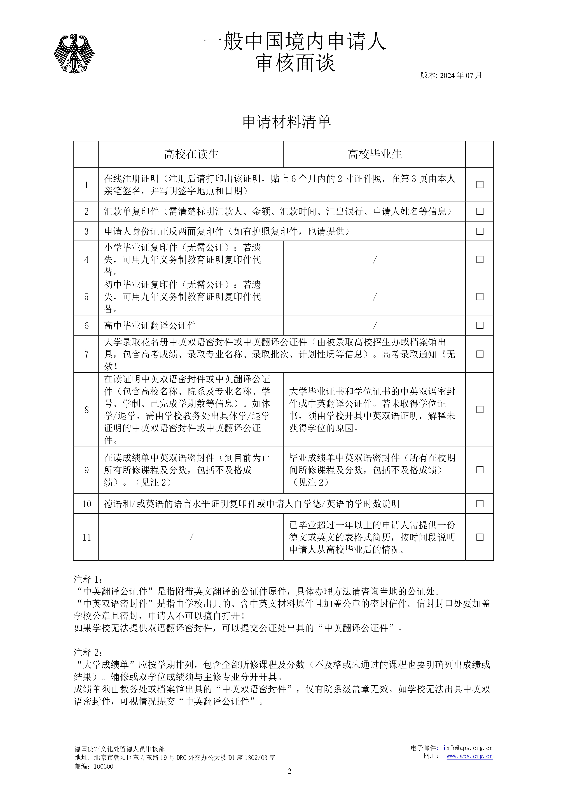
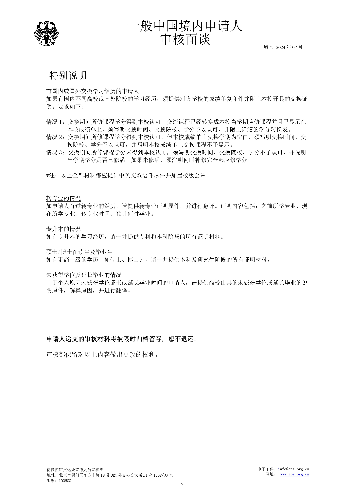
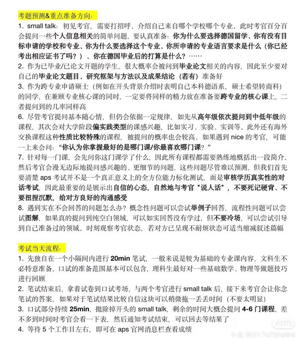

# 南科大APS审核指北

作者南科大20级计系曾宪清 决定去KTH CS啦

申请过程受到了很多帮助也在此分享APS经验希望能帮上大家，若有不对之处还请指出以便及时更正

小红书账号@[Tsuki017](https://www.xiaohongshu.com/user/profile/5f14f967000000000100518b?channel_type=web_note_detail_r10&parent_page_channel_type=web_profile_board)有分享申请季经验总结，有欧陆申请意愿的朋友也欢迎加好友交流( ⌯' '⌯)

qq: 1375926565 wx: Cintia017

## 概述

APS证书作为德国高校录取中国学生的前提条件之一，可能会是德国留学申请者的第一个拦路虎，但相信我，只要你平时有学习专业课（期末考前学也是学），听力口语能达到沟通交流的程度都无需太担心。

看到这篇的同学应该已经对APS的内容和作用有了大致的了解，如果尚无，推荐阅读这篇文章扫盲↓

[**“研究生留学德国：APS审核指南 (2024)”**](https://www.mygermanuniversity.com/zh/articles/APS-China-for-Master%E2%80%99s-applications)

首先放个官网链接：[德国驻华大使馆文化处留德人员审核部](https://www.aps.org.cn/zh/)，申请所需材料以及注意事项包括官方联系方式都可以在此找到，建议优先查阅已列举的常见问题↓，如果仍有不确定的疑问不要犹豫请直接（附上注册号）邮件联系。

接下来我将主要作为南科大CS专业学生简述我的APS申请及准备过程，主要涵盖时间线，材料准备，专业复习等

## 申请流程

申请步骤如官网所述：

时间线如下：

10/25 开始准备材料

11/03 快递寄出

11/04 签收材料

11/24 要求补交小学毕业证明（广东省九年义务教育证的时间不完整，未涵盖小学六年）

11/28 完成材料审核，开始排队面试

12/06 通知12/19上午8点面试

12/20 查到结果，”gut” 通过！

总的来说花了大约2个月左右的时间从开始准备到最终通过，当然，推荐有德国申请意向（注意比利时鲁汶大学在申请时无需APS但办理签证时需要）在完成六个学期课业后尽早开始准备。早点开始还有个好处是成绩单涵盖课程较少则询问范围也少，并且脑袋里的知识还新鲜。

## 材料准备

所需材料见官方文件规定：[www.aps.org.cn](https://www.aps.org.cn/wp-content/uploads/211_merkblatt_verfahren_china_interview_chn.pdf)

针对在读生的材料清单中的具体操作如下：

1. 汇款单复印件可选择银行转账后生成的电子回单

2. 若小学或初中毕业照丢失选择义务教育证替代，需保证证书上完整涵盖九年的上学时间，否则将被要求补交。补交方式如下：

   

3. 高中毕业证的公证翻译图省事可通过淘宝花费两三百需3-5个工作日完成，有学姐推荐自己翻译后找高中校长签名+盖学校章可免费达到同样效果
4. 大学录取花名册在我校是前往风雨操场二楼的招生办找韩少亮老师通过查阅入学时间+省份获得中文复印件，在此之后韩老师会发送一份英文的花名册模板，回去对照填写后打印带回给韩老师盖章即可
5. 在校生通过事务中心自助机打印在读证明和成绩单双语版后可前往南科大中心3楼教工部找老师盖章后用提供的信封自行密封

## 专业复习

面谈包括笔试和面试，笔试基本为基于专业基础知识的五道问答题，较为简单，约二十分钟完成，提供词典。面试首先需要你简单自我介绍，这里可以提及自身专业背景并说明德国目标申请院校，接着对着你的成绩单标注一些课程并逐个提问课程内容，大多为大二大三所学的专业课，少量面试官感兴趣的人文社科选修，可以在擅长的课程中讲解详细一些以拖时间。成绩单上分数特别高或特别低的课被提问的可能性较大。

我认为复习后只要能做到大部分课程可以口头列举几个知识点并以科普性质讲解三分钟则基本能通过。个人仅大致浏览课程大纲总结少量笔记共复习两三天就参加面试了，当场面试同学裸考的也有不少，课程知识不会问得特别深入，大四上的我已经把高数大物概统线代等忘光光了，实际也没有询问这类基础课程无需太过担忧。

附上我当时一边准备课程描述一边胡乱总结的知识点（供CS专业同学参考

（另外可能大家不太清楚但我们学校教工部有提供课程描述官网，可以作为复习参考以及欧陆申请中制作课程描述的重要指南：https://course-tao.sustech.edu.cn/kcxxweb/queryKcxxwebListChinesePC

## CS Major Review for APS

- 1. 专业基础 Major Foundation Courses
  - Data Structures and Algorithm Analysis
    - Introduction
      - This course will teach students the fundamentals of data organization, storage and processing in computer science. Students will be required to grasp why and how a data structure can be applied according to applications.
      - In this course, we will study the data structures (fundamental and advanced data structures), algorithms analysis and algorithm design methodology (generic and specific algorithm design techniques). Such knowledge is at the core of computer science, and allows us to write faster programs, especially ones whose running time has attractive worst-case bounds. Techniques for analyzing the performance of algorithms, designing beautiful/efficient algorithm will also be discussed in detail. Tentative topics to be covered include array, linked list, queue, stack, searching in ordered lists, sorting, priority queues, binary search trees, graph algorithms, finite state machine, and so on.
    - Main concepts (or themes)
      - Structures
        - **List**: In computer science, a list is a collection of elements that can be accessed in a sequence. Lists can be either **arrays**, where elements are stored in contiguous memory locations, or **linked lists**, where each element contains a reference (or link) to the next element in the sequence. Lists are versatile and can be used to **implement various data structures**, including stacks and queues, but unlike these structures, lists do not restrict the insertion and removal of elements to specific locations.
        - **Queue**: A linear structure following a First In, First Out (**FIFO**) order. Elements are added at one end and removed from the other, like a line of people.
        - **Heap**: A **tree-based** structure where each node is ordered according to a **comparison** property (e.g., in a max heap, each parent node is greater than its children). Used in priority queues and heap sort.
        - **Stack**: A linear structure following a Last In, First Out (**LIFO**) order. Elements are added and removed from the same end, like a stack of plates.
        - **Tree**: A **hierarchical** structure with a single **root** element and **nodes** having a **parent-child relationship**. Used in many algorithms and data retrieval processes.
        - **Graph**: A graph is a structure consisting of **nodes** (also called vertices) and **edges** connecting these nodes. Graphs are used to represent networks, where nodes represent **entities** and edges represent **connections** or relationships between these entities. Graphs can be **directed or undirected**, indicating whether the relationships have a specific direction.
      - Algorithm
        - **Sorting**: Sorting involves arranging data in a **particular order** (ascending or descending). Examples include algorithms like QuickSort, MergeSort, and BubbleSort, each with unique efficiencies.
        - **Pathfinding**: Pathfinding algorithms find the **shortest path** or evaluate available paths in a graph or grid. Used in GPS navigation and games. **BFS, DFS, and Dijkstra’s algorithm** are common examples.
        - **Greedy**: Greedy algorithms make the **optimal choice at each step**, aiming for a **local optimum**. Used in problems like the coin change problem, where the goal is to minimize the number of coins for a given value.
        - **Divide and Conquer**: This approach divides a problem into **smaller**, more manageable **sub-problems**, solves them **independently**, and **combines** their solutions. QuickSort and MergeSort are examples, where a list is divided and sorted in parts.
  - Digital Logic
    - Introduction
      - This course aims to provide an understanding of the fundamental concepts, circuits in digital design and expose students to the mainstream approaches and technologies used in digital design.
      - This foundational digital design course provides an understanding of fundamental concepts, circuits, and contemporary approaches in digital design. Digital logic, which underpins digital computing, is essential for understanding hardware communication in computers and electronic devices. The course covers core logical operations, basic logic circuit design, and practical applications. Students gain hands-on experience building computer hardware, learning to represent and store information as binary data. The course equips students with an in-depth knowledge of digital design principles, enabling them to design combinational and sequential circuits and apply Hardware Description Languages (HDLs) in the digital design process. It prepares them for careers in technology and computer-related fields, laying the foundation for modern logic design.
    - Main concepts (or themes)
      - **Boolean Algebra & Gate-Level Minimization**: Involves using **Boolean algebra** to simplify logic gates in digital circuits. Example: Reducing a complex circuit to a simpler equivalent using Karnaugh maps.
      - **Combinational Logic**: Circuits where the **output solely depends on the current inputs**. Example: Adders, which combine several bits of input to produce a sum and carry bit.
      - **Synchronous Sequential Logic**: Logic circuits where the **output depends on the input and the current state** of the system, synchronized by a clock signal. Example: Flip-flops used in memory elements
  - Probability and Statistics
    - Introduction
      - This course introduces the basic concepts in probability and statistics which form the basis for all applications of statistics, and for further probability and statistical theory. Also to introduce statistical methods with a strong emphasis on applying standard statistical techniques appropriately and with clear interpretation. The emphasis is on applications.
      - To introduce the basic concepts in probability and statistics which form the basis for all applications of statistics, and for further probability and statistical theory and to introduce statistical methods with a strong emphasis on applying standard statistical techniques appropriately and with clear interpretation. The topics to be covered include probability, random variables, joint distribution, expectation, limit theorems, sampling distributions of estimators, parametric estimation problem and testing hypothesis
    - Main concepts (or themes)
      - **Probability & Limit Theorems**: Probability measures the likelihood of events. Limit theorems, like the Central Limit Theorem, describe how probabilities behave in the limit. Example: The probability of flipping a coin and getting heads.
      - **Random Variables: Joint Distribution & Expectation**: A random variable represents possible outcomes. Joint distribution considers multiple variables simultaneously. Expectation is the average value of a random variable. Example: Expectation in a dice roll.
      - **Sampling Distributions of Estimates**: Refers to the probability distribution of a statistic based on a random sample. Example: Distribution of sample means.
  - Principles of Database Systems
    - Introduction
      - The objective of this course is to understand, both from a theoretical and practical standpoint, **database modeling**, to get a good knowledge of the ubiquitous **SQL language** and to understand the challenges brought by massive amounts of data, **transaction integrity,** **concurrency** and the requirement to minimize data loss after a crash. We’ll see how these challenges are addressed in relational systems as well as new database architectures
      - This course is focused on specific teaching objectives and learning outcomes in the field of database systems. It aims to provide students with a solid grasp of fundamental concepts, system principles, architecture, maintenance, and applications. Moreover, it emphasizes proficiency in database design, SQL language, and design principles. In terms of learning outcomes, students will master the entire project lifecycle for a database application system, covering project establishment, requirement analysis, data modeling, and schema design. They will also gain expertise in database development, application creation, and system maintenance. Additionally, the course ensures a deep understanding of database system architecture and core principles.
    - Main concepts (or themes)
      - **DB Concepts & Architecture**: Databases store data in **tables, rows, and columns.** Example: A 'Customer' table in a SQL database storing data like names and addresses.
      - **SQL**: SQL includes Data-Definition Language (**DDL**) for defining data structures, and Data-Manipulation Language (**DML**) for querying and updating data. Example: Using SQL 'CREATE TABLE' (DDL) and 'SELECT' (DML).
      - **DB Design & Entity-Relationship Model**: Involves structuring database efficiently. The Entity-Relationship model visualizes entities and their relationships. Example: An ER diagram representing a university database with entities like Students, Courses, and Departments.
  - Discrete Mathematics
    - Introduction
      - This course presents basic concepts in discrete mathematics needed for the study of computer science: logic and proofs, induction, set theory, functions, counting techniques, discrete probability, recursion, basic number theory and cryptography, relations, trees and graph theory. The approach of this course is specifically computer science application oriented.
      - The objective of this course is to understand and use (abstract) discrete structures that are backbones of computer sciences. In particular, this course is meant to introduce logic, sets and functions, mathematical proofs, complexity, number theory, cryptography, algebraic structures and applications, induction, counting, recurrences, relations, graph theory and related algorithms, with an emphasis on applications in computer science.
    - Main concepts (or themes)
  - Computer Organization
    - Introduction
      - This course introduces basic concepts in computer organization and design: **MIPS** instruction set, **arithmetic** for integer and floating point numbers, design and implementation of the **processor** with pipeline, memory hierarchy, and parallel processors from client to cloud, which are the fundamental of software programming in computer science. In this course, students will learn the cost performance **trade-offs**, the relationship between MIPS assembly language, advanced language as well as machine language, interactions between hardware and software, and contents related with **memory and CPU.**
      - Same
    - Main concepts (or themes)
      - **CPU Structure**: The CPU (Central Processing Unit) is the primary component for processing instructions.
        - **Arithmetic Logic Unit (ALU)**: Performs arithmetic and logical operations.
        - **Control Unit**: Directs the operation of the processor, managing the flow of data within the CPU and between the CPU and other components.
        - **Registers**: Small, fast storage locations within the CPU that temporarily hold data and instructions during processing.
        - **Cache Memory**: A small, fast memory storage area for frequently accessed or recently accessed data to speed up processing.
        - **Buses**: These are communication systems that transfer data between components inside or outside of the CPU.
      - **Instruction Set Architecture (ISA)**: Defines the CPU's functions and capabilities, including control mechanisms and addressing modes. Example: x86 and ARM architectures with different instruction sets.
      - **Pipeline and Parallelism**: Pipelining improves CPU efficiency by processing multiple instruction stages concurrently. Parallelism involves multiple processors working simultaneously. Example: Modern CPUs using pipelining for speed enhancement.
      - **Memory & Cache**: Memory hierarchy in computers includes RAM and cache. Cache is faster and stores frequently accessed data. Example: L1, L2, and L3 caches in CPUs for quick data access.
  - Algorithm Design and Analysis
    - Introduction
      - This course introduces basic algorithms, including **sorting and searching**, **divide and conquer**, etc., and their **related date structures**, to undergraduate students with some programming skills. After completing this course, students should have a conceptual understanding of the algorithms and have necessary knowledge on implementing the algorithms.
      - The course aims to introduces basic concepts on algorithms by looking at the real-world problems that motivate them. It teaches various design and analysis techniques for problems that arise in computing applications, and encourage the students to understand the algorithm design process and the role of algorithms in the broader field of computer sciences. The students will be familiar with major algorithms, such as fundamental graph-based algorithms, greedy algorithms, divide-and-conquer algorithms, dynamic programming algorithms, and network flow algorithms. In addition, upon completion of this course, the students should be able to program these algorithms for solving corresponding problems.
    - Main concepts (or themes)
      - **Greedy Algorithms**: Greedy algorithms make **locally optimal** choices at each step to find a global optimum. Example: In the _Knapsack Problem_(a knapsack with a fixed capacity and a set of items, each with a specific weight and value), a greedy approach might continually choose the item with the highest value-to-weight ratio, aiming to maximize total value.
      - **Divide and Conquer**: This strategy breaks a problem into smaller **sub-problems**, solves each **independently**, and **combines** their results. Example: The _MergeSort algorithm_ divides an array into halves, sorts each half, and then merges them into a sorted array.
      - **Dynamic Programming**: This method solves complex problems by breaking them down into simpler **sub-problems**, **storing the results** of these sub-problems to avoid redundant calculations. Example: The Fibonacci Sequence calculation, where each number is the sum of the two preceding ones, uses dynamic programming to store previous results for efficiency.

- 2. 专业核心 Major Core Courses
  - Artificial Intelligence
    - Introduction
      - The course is an introduction to AI for undergraduate students. Artificial Intelligence (AI) is a big field, we will try to explore the most important topics of the field, which encompasses search, game, constraint satisfaction problem (CSP), logic, machine learning, and natural language processing (NLP), and we will go into some depth. We will have 2 or 3 mini-projects in this course, and the programing language can be Java or Python. The students’ programs will be partially automatically graded, so they must be written to run on the computers. The goal is to provide every student who takes the course a basic set of ideas and tools to employ on AI, and to be able to pursue advanced study and research in the field if desired.
      - This course is an introduction to AI for undergraduate students. We will try to explore the most important topics of the field, which encompasses search, game, constraint satisfaction problem (CSP), logic, machine learning, and natural language processing (NLP), and we will go into some depth. We will have 2 or 3 mini-projects in this course, and the programing language can be Java or Python. The students’ programs will be partially automatically graded, so they must be written to run on the computers. The goal is to provide every student who takes the course a basic set of ideas and tools to employ on AI, and to be able to pursue advanced study and research in the field if desired
    - Main concepts (or themes)
    - Important learned things/examples
  - Computer Networks
    - Introduction
      - This course introduces fundamental communications and networking knowledge on physical, link, network, transportation, application layers, as well as basic network skills including setup, configuration, analysis and programming
      - Using the Internet as a vehicle, this course introduces the underlying concepts and principles of modern computer networks, with emphasis on protocols, architectures, and implementation issues. Students will first learn how to implement network applications (e.g., e-mail, ftp) using the existing network protocols and architectures. Students then study how/why these protocols and architectures work by using the layered organization of the Internet in a top-down fashion: Application, Transport, Network, Data Link and Physical layers. The course will also cover advance topics including software-defined networking, wireless networking
    - Main concepts (or themes)
    - Important learned things/examples
  - Object- oriented Analysis and Design
    - Introduction
      - This course introduces the fundamental concepts such as object oriented and united modeling language (UML), then mainly explores the requirement elicitation, system analysis, system design, design principles, design pattern, implementation and test. And the programming paradigms and software development methodologies will be discussed.
      - In this course, based on the fundamental object-oriented principles and UML modeling techniques, we would focus on design patterns and code refactoring approaches. This course also includes a software development project that allows students to enhance their software development skills and engineering abilities. Students need to learn website development and master front-end and back-end development skills in lab classes.
    - Main concepts (or themes)
      - **UML Model**: UML (Unified Modeling Language) is a standardized visual language for describing and designing software systems. Example: Creating class diagrams to depict the structure of a system.
      - **Design Patterns**: Reusable solutions to common software design problems. Example: The Singleton pattern ensures a class has only one instance and provides a global point of access to it.
      - **Refactoring**: The process of restructuring existing computer code without changing its external behavior. Example: Simplifying a complex method into smaller, more readable methods while maintaining the same functionality.
  - Group Projects I
    - Introduction
      - NA
      - The module is designed to give students the first experience of applying their learned CSE knowledge to solve a non-trivial real-world problem, under the supervision of an academic staff member. The primary aim is to bridge the gap between subjective-based classroom learning and real-world problem solving that requires a synergistic combination of different skills and subject knowledge.
    - Main concepts (or themes)
    - Important learned things/examples
  - Operating Systems
    - Introduction
      - This course introduces fundamental computer operation and management knowledge on scheduling, memory, file system, I/O peripheral, user interface, networking, as well as resource allocation methods. It will help students to develop programing skills for computer system management, and design proper operating systems for specific applications.
      - This course will introduce design principles and implementation methodologies. On the theory side, this course will present the basic concept of operating systems, their taxonomy, and the evolution of classical operating systems. It will focus on the three important functionalities of an operating system: virtualization, concurrency, and persistence. Students will learn how the operating system manages CPU, memory, and I/O and filesystems. On the practice side, the course will guide the students to build an educational operating system from scratch. They will learn how to handle interrupts, manage physical memory and virtual memory, manage processes, and schedule processes and build file systems.
    - Main concepts (or themes)
    - Important learned things/examples
  - Software Engineering
    - Introduction
      - The course systematically covers the fundamental knowledge, key technologies, and typical applications in the field of software engineering. It trains students' practical collaboration skills through medium-sized projects. Topics includes software processes, DevOps, version control, software requirements, software design, software build system, software maintenance, software testing, software deployment, cloud-native software, etc.
      - Concepts, methods, and current practice of software engineering. Large-scale software production, software life cycle models, manual software testing and automated software testing methods, principles and techniques for each stage of development.
    - Main concepts (or themes)
      - **Waterfall Model (**distinct, sequential phases):
        - **Requirements**: This initial stage involves gathering and documenting all the client's **needs and specifications**. Tools like Jira or Trello can be used for tracking requirements.
        - **Design**: In this phase, software architects and designers create a plan for the **software structure**. Common tools include **UML** (Unified Modeling Language) diagrams and Microsoft Visio for design documentation.
        - **Implementation**: Here, **developers** write the code based on the design documents. Integrated Development Environments (**IDEs**) like Eclipse or Visual Studio are often used.
        - **Verification**: This phase involves **testing** the software for defects and verifying it meets the requirements. Testing tools like Selenium or QTP (QuickTest Professional) are used.
        - **Maintenance**: After deployment, the software enters the maintenance phase, where it receives **updates and fixes**. Tools like Git are used for version control and collaboration.
      - **Design Patterns**: Standard solutions to common problems. Example: Singleton pattern for ensuring a class has only one instance.
      - **Agile Methodology**: A flexible approach emphasizing **incremental** development and customer collaboration. Example: Scrum framework for iterative development.
  - Group Projects II
    - Introduction
      - NA
    - Main concepts (or themes)
    - Important learned things/examples

- 3. 专业选修 Major Elective Courses
  - Deep Learning
    - Introduction
      - This course provides an introduction to the field of deep learning, covering the main deep learning techniques from both a theoretical and practical point of view. Architectures that will be covered include Convolutional Neural Networks (CNNs), Recurrent Neural Networks (RNNs), Autoencoders, and Generative Adversarial Networks (GANs) The goal of the course is that of equipping students with the necessary skills to access the rapidly evolving field of deep learning. To this end lectures and labs will draw multiple links to both the Industry and state-of-the-art academic research, allowing the students to pursue a successful career in both directions. The practical elements of the course will be based on the PyTorch framework, a widely used open source Python framework for deep learning.
      - NA
    - Main concepts (or themes)
    - Important learned things/examples

  - C/C++ Program Design
    - Introduction
      - The objective of this course is to give **a good knowledge of C and C++**, as well as a working practice of Linux, and to prepare to future courses in the Computer Science curriculum. Through lectures and small programming projects, it covers topics such as how to build a program on Linux, what are the **major differences** between a language such as C and Object oriented languages such as Java (and C++), how Object oriented Programming in C++ differs from Object oriented Programming in Java, **pointers and memory management**, data structures in C and C++, as well as system calls. The first half of the course will solely be devoted to mastering C, and the second half will present C++ and the efforts to build a “better C”, as well as how to interact with the operating system through "system calls".

      - C/C++ is a professional foundation course in computer science and technology. C is a general-purpose programming language focused on problem-solving, characterized by its simplicity, extensive data types, complete structure, strong expressiveness, direct memory manipulation, and modular application. C combines the advantages of high-level languages with low-level language features.

        C++, on the other hand, is an object-oriented development method that extends from the C language, absorbing valuable concepts and effective software engineering methods. It encapsulates data and data operations while integrating abstraction, encapsulation, inheritance, and polymorphism for highly modular, abstracted, concealed, reusable, and adaptable program development. The course is divided into two parts, covering general design principles in C++ and object-oriented programming.

    - Main concepts (or themes)
      - **Memory Management**: Involves manually allocating (`malloc` in C, `new` in C++) and deallocating (`free` in C, `delete` in C++) memory. It's crucial for optimizing resource use.
      - **Pointer and Reference**: Pointers hold memory addresses, allowing direct memory access and manipulation. References are aliases for existing variables, providing an alternative way to access a variable's value.
      - **Class & Object**: C++ uses classes for OOP, supporting features like namespaces (to avoid name conflicts) and inheritance (for code reuse and hierarchy).
      - **Function**: Functions in C/C++ can be inline (suggesting compiler to embed function body where invoked), and support overloading (same function name with different parameters).

  - Computer System Design and Applications A
    - Introduction
      - The course aims to teach students advanced skills of **object oriented programming** in java, including **network programing and multimedia processing**. The students should be familiar with java programing environment and related APIs. Students will learn how to develop a software project to solve some practical problems.
      - NA
    - Main concepts (or themes)
      - **Functional Programming & Stream**: This paradigm treats computation as the evaluation of mathematical functions. Streams in Java, for instance, allow for functional-style operations on streams of elements, such as map-reduce transformations on collections.
      - **Multi-Thread & Web Servers**: Multi-threading enables concurrent execution of two or more parts of a program to maximize utilization of CPU. It's crucial in web servers like Apache or Nginx for handling multiple client requests simultaneously.
      - **Reflection**: Reflection allows inspection and modification of a program's behavior at runtime. For example, in Java, it enables examining or modifying runtime behavior of classes, methods, and interfaces.

- 4. 通识基础 General education required courses
  - Experiments of Fundamental Physics
    - Introduction
      - Physics Laboratory I is a fundamental experiment course after undergraduates enter the university. This course plays an important role in training experimental skills, innovative thinking and practical capability of students. This course includes the fundamental physics experiments of mechanics, thermodynamics, optics, electromagnetics and modern physics. Fundamental experimental apparatus and basic science thoughts and methods are also introduced in this course. This course aims to train the scientific experimental literacy of undergraduates and enhance the interests of experimental physics for students.
      - Same
    - Main concepts (or themes)
    - Important learned things/examples
  - General Physics B I
    - Introduction
      - The main objective of this course is to introduce basic physics concepts including kinematics, Newtonian mechanics, elasticity, fluid dynamics, oscillations, waves and thermal physics. The course aims to provide trainings for scientists and engineers to apply the above physics concepts.
      - Same
    - Main concepts (or themes)
    - Important learned things/examples
  - General Physics B II
    - Introduction
      - The main objective of this course is to introduce basic physics concepts including electricity, magnetism, wave nature of light, and the introduction to relativity and quantum mechanics. The course aims to provide trainings for scientists and engineers to apply the above physics concepts.
      - Same
    - Main concepts (or themes)
    - Important learned things/examples
  - Introduction to Computer Programming A
    - Introduction
      - The course aims to cultivate talented students who have programming experience before their university study. In this course, we will introduce **the fundamentals of object oriented programming language (java) and programming techniques**, and the students will be familiar with a programming language and be able construct software for **solving general programming problems.**
      - The course introduces the fundamentals of object-oriented programming languages and programming techniques, as well as basic syntax. It also provides preliminary knowledge of data types and data structures. Students will become familiar with two popular programming languages, namely Java and Python, and will be able to create programs to solve general problems.
    - Main concepts (or themes)
      - Basic data types and data structures
        - Primitive data types: byte, short, int, long, float, double, char, and boolean
        - Common data structures: arrays, strings, lists, sets, maps, stacks, and queues
      - Class & Object: constructor, methods, etc.
        - A Java **class** defines a **blueprint** for **objects**, including fields (**variables**) and **methods** (functions). _Example_: class Car with a constructor, speed method. Objects are instances of classes.
      - 3 features of object-oriented programming (OOP): **encapsulation, inheritance, polymorphism.**
        - OOP in Java focuses on creating objects with characteristics and behaviors. Features include **encapsulation** (securing data), **inheritance** (reusing code), and **polymorphism** (many forms). _Example_: a Vehicle class inherited by a Car class.
  - Calculus I A
    - Introduction
      - In this course, we emphasize intuitive and conceptual understanding of theory of single-variable Calculus, computation skills, and nurture the mentality and the ability to use Calculus to solve problems in other scientific disciplines. The course will cover limits and continuity, derivatives, single variable integrals, and ordinary differential equations.
      - Same
    - Main concepts (or themes)
    - Important learned things/examples
  - Calculus II A
    - Introduction
      - In this course, we emphasize intuitive and conceptual understanding of theory of multi-variable Calculus, computation skills, and nurture the mentality and the ability to use Calculus to solve problems in other scientific disciplines. The course will cover series, calculus of vector functions, partial derivatives, vector fields, and multiple integrals on regions in Euclidean space and on curves and surfaces.
      - Same
    - Main concepts (or themes)
    - Important learned things/examples
  - Linear Algebra A
    - Introduction
      - To introduce the basic concepts in linear algebra including systems of linear equations, matrix algebra, determinants, vector spaces, linear transformations, eigenvalues and eigenvectors, singular value decomposition and quadratic forms. It is a prerequisite for Linear Algebra II. The emphasis is on operations with matrices, solving systems of linear equations, fundamental theory of vector spaces and linear transformations, solving eigenvalues and eigenvectors problems, and quadratic forms.
      - Same
    - Main concepts (or themes)
    - Important learned things/examples
  - Introduction to Life Science
    - Introduction
      - BIO102B is an introductory/discovery course for freshmen (but not limited to) to understand biology through laying out some major modern-day issues that we and other species of the planet have been facing. In the past half century, the biological and biomedical research represents an actively evolved rapidly progressed scientific field to expand and somehow to quick subvert traditional and contemporary knowledge of life. The course is thus intended to explain why the field is challenging and requires an enormous effort of inter-disciplines (including but not restricted to the chemistry, physics, mathematics, medicine, computer science, health science and material science) and why biotech and biomedical research has been heavily invested in developed countries around the world. Unlike the stereotype of biology course, i.e., applying a few theorems or rules and memorizing lots of names, terms and facts, BIO102B would guide the students to experience a new learning journey of life science, and to cherish, revere and appreciate life more.
      - BIO102B offers an introductory approach to biology for freshmen and others interested. The course explores pressing contemporary biological issues and the rapid evolution of the field, transcending traditional knowledge. It emphasizes the interdisciplinary nature of biology, involving chemistry, physics, mathematics, medicine, computer science, health science, and material science. BIO102B highlights the substantial global investments in biotech and biomedical research. Unlike typical biology courses focused on memorization, it encourages students to embark on a dynamic learning journey, fostering a deeper appreciation for life and its complexities. This course aims to instill a profound respect for the science of life.
    - Main concepts (or themes)
    - Important learned things/examples
  - Introduction to Python Programming
    - Introduction
      - The course starts with an introduction of variable types in Python and their basic rules. These are followed by the explanations of the commonly used packages in Python such as NumPy, SciPy and Pandas. We also introduce the flow control, functions and basic 2D and 3D plotting using Matplotlib. At the end, the high-level application such as object-oriented programming are also introduced.
      - NA
    - Main concepts (or themes)
    - Important learned things/examples

- 5. 其他（人文社科艺术英语体育思政）General education elective courses
  - Introduction to Chinese Information processing
    - Introduction
      - This course give a fundamental introduction to Chinese Information Processing (CIP), including: 1. the nature and history of CIP; 2.the fundamental principle of CIP, like corpus, matching, rules, statistics, and corpus annotation; 3. frequently-used tools, corpora and how to use them. We’ll do some computer programming in this course, so it is easier for students who have enough knowledge on programming. However, the programming tasks in this course are too easy to worry about for most students.
    - Main concepts (or themes)
    - Important learned things/examples

## 其他可能有用信息

另附上准备过程中在网上搜集的一些经验总结帖（作者见水印）

