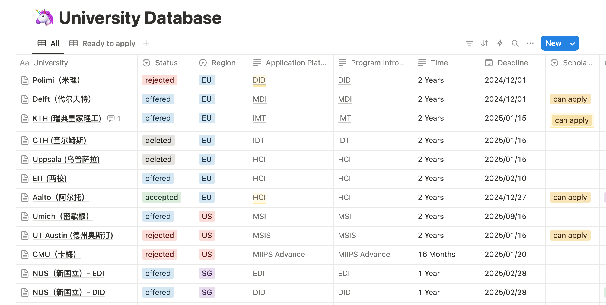

# [EU]21-周柯宇-MS HCI @ Aalto

## 基本背景

> - 姓名：周柯宇
> - 专业：工业设计（南山三期）
> - 总 GPA：3.93/4.0, 排名：1/13
> - 语言
>   - TOEFL：103 (R:28 L:27 S:23 W:25)
>   - GRE：326 (170+156+3.5)
> - 海外交换：新加坡“创业实习”交换项目
> - 文章：1 篇水会共一（深度学习相关）
> - 实习：2 段实习，均为初创公司（申请时）
> - 设计竞赛：1 个二等奖

## 申请结果

### 最终去向

芬兰阿尔托大学 人机交互全奖硕士 MS in HCI @ Aalto (100% tuition fee waiver)

- Aalto's HCI is ranked #1 in Europe in the 2020s by CSrankings
- Aalto is ranked #8 globally in Art & Design by 2024 QS Rankings

### 其他录取结果

<!-- cSpell:words Umich Polimi MIIPS MSIS -->

- Offer:
  - 瑞典皇家理工 KTH - Interactive Media Technology (IMT)
  - 荷兰代尔夫特理工 TUDelft - Design for Interaction (DFI)
  - EIT 项目 - 第一志愿录取
    - Entry: Aalto Exit: KTH - Physical Interaction Design and Realization
  - 密歇根大学 Umich - Master of Science in Information (MSI)
  - 新加坡国立大学 NUS - Engineering Design & Innovation (EDI)
  - 新加坡国立大学 NUS - Division of Industrial Design (DID)

- Rej:
  - 米兰理工 Polimi - Digital and Interaction Design (DID)
  - 卡耐基梅隆 CMU - Master of Integrated Innovation for Products & Services (MIIPS)
  - 德州奥斯汀 UT Austin - Master of Science in Information Studies (MSIS)

## 写在前面

在申请季和大学生活中真的受到了很多 sdim 学长学姐非常非常无私的帮助，欠了好多顿饭不知道有没有机会还上，在这里衷心感谢你们🥹。

我很爱联系学长学姐，因为他们已经经历过相似的阶段，有很多宝贵的经验是可以学习借鉴的。但是截止目前为止，好像从来没有学弟学妹来找我聊过天（我们系人很少啦，一届才十几个人，你要相信学长学姐都是很愿意帮忙的☺️）。所以我在这里就稍微写点我的经验之类的，就算一个小小的贡献和传承吧，当然更欢迎线下找我 1v1，我真的很喜欢聊天 hh。

下面的内容主要分两部分，一个是我梳理了一下我个人的经历可以参考一下，还有一个是纯 diy 申请的经验分享，希望学弟学妹以及其他读者能从我众多废话中发掘些有营养的。

## 个人经历

### 设计 vs 科研

这个问题应该是只会存在于 sdim 的吧，不知道以后学弟学妹会不会有，但对我来说，这个问题我一直纠结了很长的时期，所以我想花些篇幅聊一聊。（这一部分废话很多，其实可以跳过哈，而且仅代表我个人体验）

sdim 算是个很特殊的专业，之前一个学长和我说，sdim 是希望延长做选择时间的人才会来的地方，因为可以一直不真正做决定，什么都先学着。我现在来看还蛮赞同的，尤其大二的时候，sdim 的课程我当时觉得有点太探索了，因为我们一门专业课就是其他专业可能要学 2 年的内容，这样的课还特别多，你也不知道学他干什么，但是也就先学着再说。而且哪怕当时打算走科研，也得被迫学一半的设计专业课。这样的课程设置好像让人很难下定决心走某一个方向。

我个人的话，最开始其实想去计系的，一直犹豫去不去。选择 sdim 算是一个折中方案，什么都学点懂点，然后在一个方向专精，我就可以选择计算机方向专精，感觉还蛮理想的（按照当时 sdim 宣传来说是这样的）。

学着学着发现设计还蛮有意思的，设计更多是指发现痛点，解决问题，和我想的偏艺术很不一样。同时呢，刚进专业我就联系教授申请入组，想尝试科研拥有计算机方面特长，但是科研实在是我没有那么喜欢，但是就一直硬坚持着，两个都不想放，因为确实没想好以后要干嘛。

这样的状态一直持续了很久，我整个大二暑假和大三上非常纠结焦虑，但在快到大三寒假那个时间不做决定已经不行了，你不可能永远设计科研两手准备，设计要准备作品集，科研要开始做研究跑实验。

那个时候的解决方法就是找学长学姐聊天，截止到我这一届为止，sdim 出现这样的情况是非常多的，甚至有学姐和我走过一模一样纠结的过程，所以听听他们当时的想法很重要。其次呢，就是找朋友聊聊，有时候你自己看不透你适合什么，但是认识很久的朋友真的有时候更了解你。

大概是大三的十二月份，我理清楚也知道自己想要干什么了，也下定决心决定转设计了（插一句，截止目前我的职业规划是产品经理，欢迎有类似想法的同学找我聊天！）。我确实纠结了很久，感觉足足有半年，现在觉得这一段纠结可能也是必经之路吧，就跟其他学科的同学纠结 MS 还是 PHD 可能差不多。后面的申请虽然很忙很累，但是都比这段时间心情轻松，因为就是按部就班一个个完成就可以了。

并且值得一提的是，之前的探索并没有因为我的转方向而浪费，我的科研经历让我在申请季和其他设计申请者相比拥有独特的计算机背景，我猜测正因如此我才获得了人机交互专业的全奖。

当然这只是我的经历，可能在世俗的时间框架下，早做决定是好事，可以留出更充足的时间在该领域产出。当然，sdim 的教学模式导致学生在任何方向的可能性都很大，大家的经历和去向都很丰富多彩，慢慢探索也很好，总之人生不会完蛋的😉。

### 时间轴

大二上：科研（进组，自学深度学习）

大二寒：考出托福成绩

大二下：科研（继续自学深度学习，参加组会，看论文）

大二暑：留校搞科研无产出（导建议写一篇综述，但是中道崩殂🤕）

大三上：考出 GRE 成绩；发表共一论文（那个时候觉得发一篇可以了，也算对之前的投入有一个交代，可以安心转设计了😇）

大三寒：第一段实习 1 个月

大三下：制作作品集准备外申

大三暑：设计竞赛二等奖

大四上：新加坡“创业实习”交换项目 - 第二段实习 5 个月；申请季在新加坡

### 海外交换

这里想重点提一下这个交换经历，我会觉得大学四年里，出去的这半年是我学到最多的，真的开阔了眼界，也是这段经历坚定了我一定要外申的想法。

我参加的是 NUS-NOC 项目，这个是学校的交换项目，需要获得学校的推荐资格。（大概是需要提前大半年报名的，记得关注邮件！）非常推荐以后想就业的同学参加。

主要内容是在新加坡的初创公司实习 5 个月，同时还会在 NUS 上一门跟创业相关的课程。这个项目中你会认识新加坡以及其他国家来参加 NOC 项目的同学。比起一般的授课项目，我觉得可能实习能让你更容易和当地人有接触，能有更多机会进行思想、信息的碰撞。（毕竟上班你每天和同事得待在一起，有种强制社交的感觉，比授课型需要自己去社交会对 i 人友好一些，本 i 人觉得）

当然其他的交换交流项目也很不错，还是非常推荐本科阶段出去看看的。

## DIY 申请

为什么没有选择中介呢？

一个呢是设计的申请有点贵，涉及到作品集感觉至少 8 万起步，但实际上我觉得中介的作品集大部分质量很堪忧（目前我只知道一位一期学长当时找做的还不错），真的不如 sdim 自己的项目有特点（会在作品集部分细说）。

另一个呢是我不太敢放权给别人做这么重要的事情，小红书上包括我身边真的存在因为中介的失误交错或者漏看到而影响申请的例子，而且我觉得自己足够 J 可以应付这些，所以决定全部自己来。

### 选校

- 地区：我算是全球大混申（欧洲+少量美国+顺手申了新加坡）

- 项目：差不多偏交互方向和 UX 方向就可以 我不太想申纯工业设计（一般硕士的工业设计会有一点点偏机械，而我更想偏软件和计算机相关的）

- 选校 list 参考：学长学姐的（感恩🙏） + 小红书

  我们走设计方向的学长学姐的选校 list 都差不多，其实甚至可以拿过来直接照着申请，可以节省很多时间。然后小红书一些中介整理的帖子再做一些补充，基本上热门的项目肯定都能看全。

  也可以试试联系中介，让他们给一个选校定位，一般到这一步是可以白嫖的。

- 工具：我想 sdim 的同学都会使用 notion 吧，强烈建议用 notion 自带的 database 来进行管理，下图是我的 notion 页面截图，我觉得非常清晰整洁，J 人很满意。

  

- 关于美硕：
  1. 因为设计读博的很少，竞争全在硕士上，所以设计的美硕申请难度跟其他专业不在一个等级上！
  2. 语言要求非常高，很多都要求托福口语 25 以上，因为语言很多学校我就都干脆没有尝试了。
  3. 照近些年的结果来看，基本都只收美本海本的同学，有的项目甚至是从来没有录过陆本的同学。（我混在一些小红书申请群里得知的）
  4. 有工作经历会相对好申一点。（想申的话感觉有一段大厂实习会比较加分）
  5. 照我自己和一二期学长学姐的申请结果来看，美硕相对是很不顺利的，而欧洲会好申很多。（所以尽量不要 all in 美硕）

- 经验：多申广申！

  我申的算很少的，一共只有 10 所，主要是因为我其实当时有非常确定的去向，我当时就是想去 KTH IMT（当时我所有的朋友被我念的都知道我要去），而且凭我的成绩之类的 90%的概率是能去的，所以我当时其他的都可以算顺手申的。而 Aalto，反而是我最不了解的一所学校，甚至没听过（但是连我不学设计的同学都听过，所以完全是我的问题）。当时真的是随手申的，是发给我录取信和奖学金之后我才慢慢去了解这个学校（那个时候我 KTH 学费都交了！），才发现原来它这么强 hh，没想到最后真的去的就是这个。所以强烈建议大家多申广申，甚至申的时候都别考虑会不会去，拿到 offer 咱们再纠结嘛😋！

### 语言

比较幸运的是我托福（103）和 GRE（326）都是一次过的。

- 建议分数：基本上申请托福 100，GRE325 肯定够了，但是要申美硕的话，托福口语 26 会比较稳，我目前看到最高应该是华盛顿大学口语 26。
- 经验：早点准备。我进南科大的时候分级考试是 C，但是我准备的比较早+考前突击一个月。
- 考试时间：我托福是大二下 2 月份考的，GRE 是大三上 10 月份考的，
- 有效期： 因为我托福考的比较早（甚至是考的老托福考试），申请特别害怕过期，但实践证明只需要考试时间（+2 年有效期后）在申请截止日期之后就没问题，要是不放心的话，可以三月份再去考。
- PS：因为我们准备的大头在作品集上，所以强烈建议在大三下前准备完，不然又要做作品集又要备考语言我觉得还是蛮痛苦的。

### 作品集

- 尺寸要求：在正式做之前，一定要去每个项目找一遍要求。
  - 一般都是上传文件的要求，比如文件大小不超过 20MB。
  - 我的 list 中只有代尔夫特有页面大小的要求，要求 A4 大小
  - 建议一开始做的时候就可以适用所有项目（比如我的，我就应该一开始就做 A4 大小，但是我是最后才改的，figma 调尺寸大小极度痛苦🙃，不亚于重新排版，血泪教训😭）
- 工具：一般就用 Figma 就可以。

- 项目数量：
  - 4 个主要项目 + 2 个 other work （可以满足所有学校的要求）

  - 主要项目每个 4 页，other work 每个 1 页

- 项目选择：
  1. 大三 - 大项目
  2. 交互设计 - 课程项目
  3. 计算设计 - 课程项目
  4. 新加坡交换的时候独立做了一个
  5. 智能设计 - 课程项目（other work 1）
  6. 我发表的一篇论文 （other work 2）

- 可以看到，我基本就是全拿的学院的项目。学院的项目优势在于：
  1. 我们有实物同时一般也会包含代码之类的，有结构有功能。相对是具有落地性的。（我有跟其他学校的交流过，很多设计专业的作品集可能就是纯外观设计，所以这点一定是优势，而且是很大的优势！）
  2. 学院不同的课就会有不同的侧重点，你只需要排版体现出来就可以体现不同项目之间的差异化。
  3. 学院一般是一门课大半个学期做一个项目，时间很充裕，这里的工作量可以足够撑得起一个作品，而不是纯靠排版排出 4 页来。（前提是不要摸鱼，上课好好做调研之类的）
  4. 学院项目有多次汇报，教授还能帮你把把关（至少能保证你的逻辑大致是通顺的）。
  5. 最重要的是你不需要额外做了，省钱省时间。

- 排版参考：学长学姐的作品集（再次感恩🙏） + 小红书

- 作品集时间线：

  我是大三下 3 月份的时候开始做，最后做完是 10 月份。（最早的 ddl 是 12 月 1 号，所以推荐在 11 月前做完，11 月写写文书差不多）

  具体的时间线：
  - 3 月份开始整理大三上的大项目，第一个项目因为不熟悉作品集排版花了比较久的时间，大概有 2 个月。

  - 第二第三个的项目正好就是大三下正在上的课，所以我在做课程项目的时候就想着要放进作品集，所以资料留存的比较全，基本上结课就把作品集做完了。

  - 第四个项目因为前三个项目的积累以及对作品集非常熟悉了，虽然当时不在国内很不方便，但基本上就花了一个月就完成了，这个时候大概是 9 月。

  - 最后一个月给学院的各个老师、我的朋友们过目，改排版之类的，最后定下来应该是 10 月。

- 忠告：一定在做项目的时候记得留存资料，照片能多拍就多拍，我大二因为没想过走设计一点资料没留，做作品集的时候大二的项目就完全用不上。

- 可以用 notion 做一个简易网站，当作线上作品集，有些美硕会要求只能交链接的。

### 文书

主要靠 GPT，写完给语言中心的老师和同学把把关就可以。

### 参考资料

[DIY 留学攻略指北【人机交互/数字媒体篇】](https://docs.qq.com/aio/DRGlmTG5LanhPSUdP?p=A8ZLWYxJZ7HIATrLIPCca0)
（我 DIY 后期发现的宝藏，分享给你们！🫡）

## 联系方式

微信：bench1218

邮箱：<mailto:benchu1218@gmail.com>

PS：

1. 来芬兰线下找我玩的话，我会请吃饭哦！
2. 有类似产品经理职业规划的人也欢迎来找我聊天呀！
