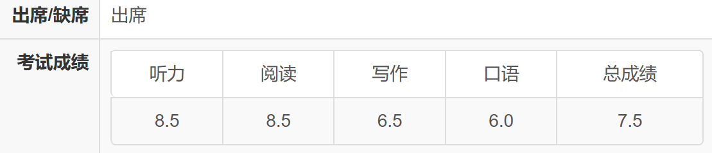

# 雅思备考指南

<!-- cSpell:words Jiaju -->

作者：Zou Jiaju \
联系方式：<mailto:zoujj2020@mail.sustech.edu.cn>

本文是作者参考飞跃手册中 [2 个月自学雅思总分 6-7](../76) 后对自身备考过程的一个记录，里面的经验方法到现在也还非常适用，非常感谢前辈的经验分享。

## 写在前面

本文针对雅思考试的 4 个部分分别给出了一些备考经验，供大家参考。附上成绩单：

~~典型小组做题家の哑巴英语~~

在考出这个成绩的时候我已经从南科大毕业快 1 年了，在北京一所无英文环境的某航读研，脱离英文环境差不多有 1 年半了。  
在南科大的同学具有非常丰富的英文资源和环境，肯定可以考出比这更好的成绩（尤其是口语），相信自己，加油！

## 关于听力

从初中接触英语开始，听力一直都是我的一个很薄弱项，以至于在南科大的时候，遇到外教打招呼之后都听不懂他在说什么😭，然后就开始尬聊😂，说一些 yes，right ，good 之类的。（还记得大一下的时候参加致仁书院的英语角活动，AL 和我打完招呼后问了个不知道什么的问题，然后我回答 "yes that's right"，完后看到他一脸震惊的说 "what? That's right???" 😅 ）

所以这里雅思听力出分 8.5 我觉得挺惊喜的，可能有一点运气成分，但我觉得还有一个非常重要的训练方法：**精听**

雅思听力和托福不一样，在听的时候是可以看到题目的，而且还有单词拼写的题目，所以能在一段音频中听懂其意思并快速捕捉到答案单词是非常重要的。

我们将雅思听力分为 4 个部分，一般来说，Part1 和 Part4 分别为简单填空和学术填空，这两个部分各 10 个空，如果在另外两个 part 还有填空题的话，那填空占比就直接高于 50%，所以听写单词就显得尤为重要了。从备考角度来说，也非常建议先备考填空题，然后是选择题等其他题目。

当时备考的时候，对听力也是最先开始的，前前后后大概准备了 1 个半月左右，这里是当时做的一些[记录](https://mubu.com/doc/4yGB4nygTDh)，供大家参考。（如果链接失效了邮件踹我一下）

## 关于阅读

阅读可能是雅思考试中比较难的部分了😨，我们有 3 篇文章，40 道题，限时 1 小时，对于阅读能力的要求很高，所以首先需要保证的是自己的词汇量，在保证自己能看懂文章的 70%及以上的时候，所谓的做题技巧才能发挥作用。  
关于背单词，我用的是不背单词 APP（单词高利贷），用了差不多 1 个月左右，每天背 100 个左右加上复习，坚持一段时间，对词汇量的提升是非常有帮助的。

~~累计时长那么多是因为挂着后台忘清理了~~

总的来说，阅读需要的是能看懂，然后才能说技巧，对于已经适应了全英文教学的南科大学子，多多准备，合理刷题，相信自己，一定没问题的😉。

关于阅读的备考，这里也做了[一些记录](https://mubu.com/doc/7DqH27aqS7h)，供大家参考。（如果链接失效了邮件踹我一下）

## 关于写作

写作分为 2 个部分，一个大作文，一个小作文。

需要指出，写作 6.0 大概是排名 40%左右，写作 6.5 大概排名 10%以内，但要想得到 6.5 其实并不需要非常华丽的词汇，也不需要非常高级的表达：

**不出现语法拼写错误、表达清楚、结构清晰，就能有 6.0，然后句式稍微变换一些、论述内容合理充分不空洞，就能得到 6.5 的分数了（亲测😋）。**

这里基于 B 站九分学长的写作公开课对不同类型的作文模板做了[一个总结](https://mubu.com/doc/5ASmOc2t8Ch)，供大家参考。（如果链接失效了邮件踹我一下）

## 关于口语

考前大概 1 个月半的时候我也浏览过雅思哥 APP 的口语题库，当时想着每天练习一个 topic，到考试之前绰绰有余哇😁，结果 1 周之内练了 3-4 个 topic 就没坚持下去😪。

后面发现口语题库的题目真的太多了，能全部背下来是不可能的😢，能全部过一遍也不现实😓，索性就直接摆烂了😆，裸考，没想到出分还能接受，就很玄学。

现在回想起来，在南科大的上的 4 门英语课还是挺有用的，人少是一个很大的优点，不要害怕表达自己的观点和想法，大声说出来。
这里给分享一下在南科大上英语课学到的一些方法，供大家参考：

<!-- cSpell:words Pellerine -->

- SUSTech English Ⅱ，AL 每周会给大家布置 Video Assignment, 就是给一个 Topic 自己录制一段 2-3mins 的视频，给出自己的观点和看法，这个就很像雅思 Part2 的考题，录制的视频自己可以反复观看。自己给自己纠错（当然，刚开始看的时候是很尬的👽），如此重复 2-3 次应该就能发现自己的一些小错误（比如语法、时态、单复数这些），这对于快速提升口语帮助是非常大的。

- SUSTech English Ⅲ，需要做很多 pre，我很担心自己的发音问题，当时的任课老师 Stephen Pellerine 告诉我说：  
  _"If you speak but others don't understand you, that's their problem, not yours."_  
  要想表达自己的观点，先要说出来，不管说的好不好，说出来才是第一步，哪怕说的有口音或者不标准什么的都没关系，多说几次自己自然就会注意到的，因为口语实际上是训练一种肌肉记忆，不自觉地能蹦出单词去描述自己所想的东西。

关于答题的技巧，这里也基于九分学长的口语公开课做了[一个小结](https://mubu.com/doc/7mGC5QVuPnh)，供大家参考。（如果链接失效了邮件踹我一下）

总的来说，看好多节课以后还需要自己主动张嘴去说，课程只能提供一个思路，说的内容还需要自己亲自张嘴才能有所领悟，先不要担心说错，大胆说就完了。~~据说，雅思口语考试时能发出人类的声音，就有 4.5 分~~

## 关于换题季

在报名雅思之前，也确实听说过换题季这个概念，大概来说就是 1-4 月、5-8 月、9-12 月为 3 个题季，有建议说是尽量避开一个题季的最后几天，因为有概率抽到新题（口语、写作）。

但话说回来，口语和写作的题库里面那么多题目（eg: 雅思哥 APP），全部背下来是不可能的，不管什么时候考，语言能力的高低是不会改变的，所以我认为不必在意换题季这个说法，与其祈祷考场上能抽到原题，不如将考前的题库练习作为提高语言能力的一种方法，好好准备一定行的！

## 关于机考 or 纸笔

两者各有好处吧，我参加的是机考，这里结合自身经历说一下机考的体验：

- 考试场次很多，相比纸笔出分也很快（考完的第三天下午，有些特殊渠道甚至可以在考完第二天下午就查到分数😏）
- 听力的单词拼写不区分大小写，平时训练听写的时候，建议使用键盘练习单词的拼写
- 阅读的时候，屏幕一半是题目，一半是原文，可以直接从原文中 copy 单词到填空题中
- 写作不用担心排版问题，而且实时统计字数，如果大作文背了一些简单的模板的话可以先把模板句子打出来然后往里套观点

对于习惯了纸笔做题的同学来说，刚开始机考肯定会不熟悉，觉得没有纸笔好，但是如果做了几套题目以后，会觉得其实机考还是很方便的，如果不确定自己要不要参见机考，可以用雅思哥机考软件先模拟一下，相信你会逐渐熟悉机考操作并发现一些好处的。

## 关于复议

复议成功退钱，不成功不退。如果距离目标分数就差一点点，可以试一试，其他情况建议还是不要去送钱了 QAQ。就我自己首考的这个分数而言，口语 6.0 在申请 PhD 的时候还不知道会不会被卡，但是毕竟啥也没准备就上考场了😂，所以就不打算复议了，如果后面申请的时候被卡了那就再考一次😇。

## 关于预算

这里记录了在整个备考过程中我所[用过的软件和使用体验](https://www.mubu.com/doc/3gpS05y5hLh)（不是广告），供大家参考。（如果链接失效了邮件踹我一下）

## 写在最后

想开始的话无论何时都不算晚，对于有语言要求的同学来说，非常建议先报名一个距今 1-2 个月的考试。（我本科的时候一直在犹豫参加英语考试，很多事情自己经历之后才能有新的体会，干就完了✌️）

英语学习是一个持续的且不断积累的过程，得益于南科大全英文的授课环境（textbook、lecture、assignment、pre & project 等等），南科人的英语水平都是很高的，相信自己，fighting!!! 💪💪💪
