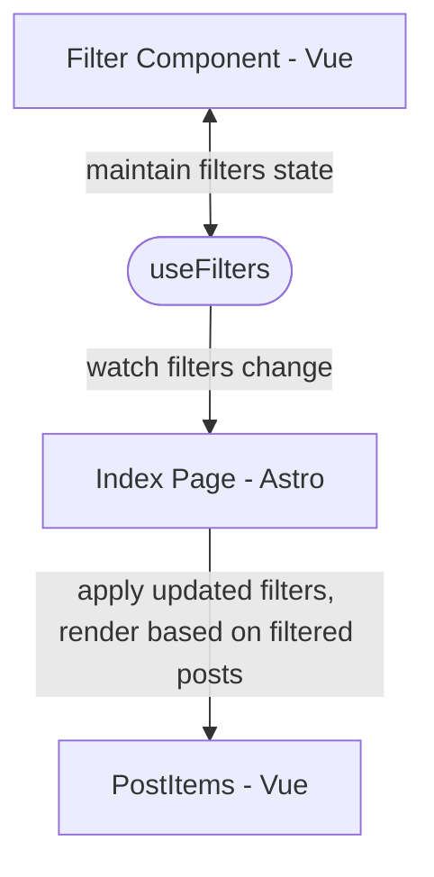

# Documentation for v2.0

## Engineering Decisions

### Why Astro?

Other SSG frameworks surveyed include Hugo, Jekyll, Docsaurus, Hexo, Eleventy.
Next.js was also under consideration. Astro was eventually adopted for the
following considerations:

- Markdown oriented. No additional configurations needed for pages rendering.
- Lightweight, easy maintenance.
- Integration with components written in other frontend frameworks, such as
  React and Vue. The search/filter feature and posts displayed are complex
  and are preferably implemented with a framework. This also makes maintenance
  easier.
- Islands Architecture. Ship less JavaScript while still benefiting from
  a frontend framework.

### Why Vue?

- More lightweight than React.
- Familiarity among SUSTech students.

## Architecture

The state management (reactivity) can only be achieved in the Vue components,
such behaviors cannot be achieved in the frontmatter section of Astro, since
that is only used in the build time and Server-Side Rendering, and thus not
suitable for static site like SUSTech Application.

Astro recommended using `nanostore` as a lightweight solution for reactivity
and state management across components (or dynamic islands).
