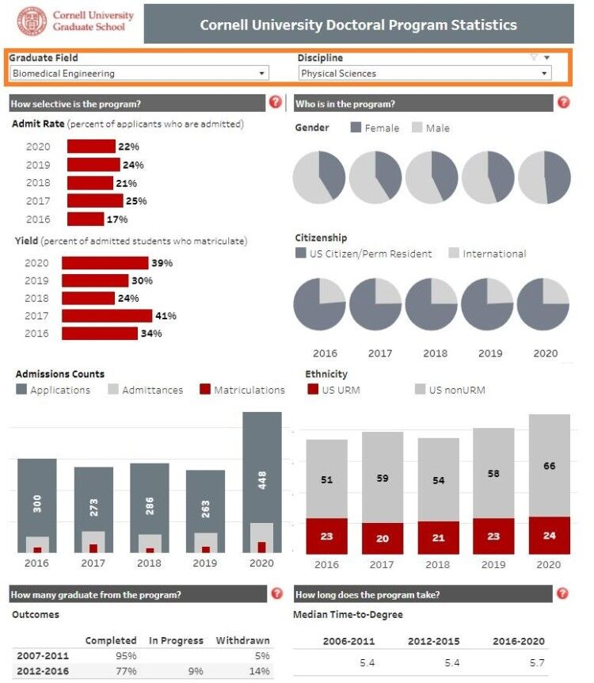
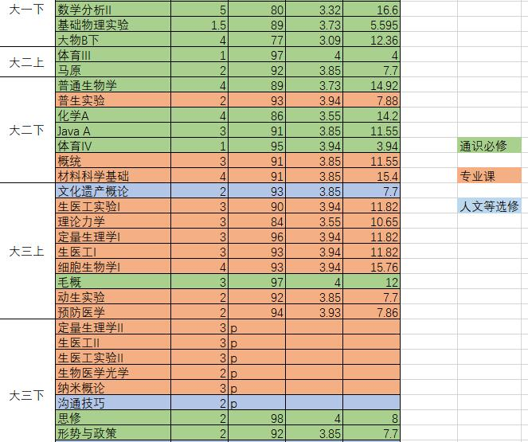

# [SG]-17-孙锐 PhD @ National University of Singapore

### 基本背景：

> 姓名：孙锐
>
> 专业：生物医学工程（兼修数学系课程和BME研究生课程）;
>
> GPA：专业3.82/4.0，总3.60/4.0；KCL暑期项目overall rank A;
>
> TOEFL: 裸考100/120 (Reading 30);
>
> GRE：156V+169Q+4.0AW（2021Fall大部分学校都不需要提交GRE）
>
> 科研：2篇SCI一区research article(一篇一作，两篇均IF≈7~9)，2篇待投。
>
> 推荐信：南科大学术导师、南科大BME系主任、KCL BME系主任

### 申请结果

> 最终去向：新加坡国立大学全奖Ph.D.（MBI joint with BME）
>
> 其他Offer：
>
> BME MS/Ph.D. @ Columbia University
>
> BME Ph.D. @ UC Irvine
>
> BME ScM @ Brown University
>
> BME ScM @ Rice University
> 	

### 申请心得：

#### 导语：

相比飞跃手册里的各位巨佬，一切平平无奇的我其实是不应该出现在这里的。但我还是不想失去一个给学弟学妹避雷的机会，也是因为最近蛮多人在问我申请心得，于是索性写一篇申请血泪史出来，让后人少走一些弯路。

2020的疫情导致我们这一届失去了宝贵的暑研机会和大四的交流项目，大三一年在南科大的科研也都近乎搁置。托福GRE考位抢不到，大量课程被迫P/F都让我们很是难受。2021Fall的申请，我总共投了11所美校外加NUS（最后决定去NUS，相当于美国白申，想想近万块申请费白交的我直接好家伙），本文不分美/新的异同，主要讨论Ph.D.申请的一些内容。如有其它问题可加QQ：1006796669。

#### 经验分享：

##### 1. 选校/项目选择

**1.1 Master or Ph.D.?**

这部分按照自己未来的职业规划等因素因人而异。对于比较确定将来要做科研的同学，直接申请Ph.D.会是一个比较好的选择。而且其实master与PhD只是一个初步分类，还有很多诸如Master of Science (i.e. MS or ScM), Master of Engineering (i.e. MEng), Doctor of Engineering等等。网申注册完账号之后的前三步之内基本就要你选择申请项目了，各位学弟学妹一定要睁大眼睛看好自己有没有选对！（我在申请NUS的时候，项目就给选错了，因为他的博士项目叫FoE而不是PhD。后来NUS的committee给我发邮件询问我，我才发现选错了，很感谢他们把我捞了回来）

**1.2 选校**

我该参考什么排名？是否常青藤？QS？USNEWS综排/学科排名？泰晤士？软科？
USNEWS的学科排名是相对可信的选择，**建议将USNEWS学科排名当成首要参考，其他几个排名作为辅助。**倘若你打算一直走科研这条路，可以完全不考虑任何学校的专业/综合排名，直接以课题组为导向，去试着套磁、申请你感兴趣领域的大牛。但请务必注意这句话的前提是“一直走科研这条路”，因为如果你将来要回国进入industry/company发展，公司大概率并不知道你PhD的导师可能是这个领域的开拓者，他只会关心你PhD的学校名字够不够响亮。
选校时的一些小策略也是必不可少的。各大高校基本都会在系官网、学校官网等位置post出自己的admission data（也有的学校会很难找，可以直接在他官网的搜索处尝试关键词admission data/statistic/facts/自己发挥）。该学校的录取率、平均毕业年份、国际生比例基本都能找得到，有的学校还会post自己往年录取的学生GRE/TOEFL的成绩。这样你就可以知道这所学校的申请难度如何，按照自己对自己的定位决定是否申请（彩票费也好贵呜呜）。下图是我感觉做的比较好的Cornell University，列的非常清楚，而且可以在最上方选择你想申请的系。这样的话，**对于一些交叉类的方向，就可以选择申请难度较低的系申请**（比如一个做生物材料的教授可能在BME/MSE/医学院甚至是力学系，一个做外骨骼的教授可能在BME/机械系/力学系）。还有一些第三方网站（例如一亩三分地、某乎、gradcafe）可以参考[邓雨晴学姐的分享](https://sustech-application.github.io/2020-Fall/#/grad-application/biomedical-engineering/[US]-16-dengyuqing)。

##### 2.导师选择/套磁

这部分我当时也是参考[邓雨晴学姐的分享](https://sustech-application.github.io/2020-Fall/#/grad-application/biomedical-engineering/[US]-16-dengyuqing)，我就大概说一下套磁。套磁不需要特别早，我套磁分了两批，分别是在网申开始的初期和提交申请后。对于committee不那么强势的学校，套磁是比较重要的，**但套磁前一定要先对目标导师的研究有较为深入的了解**（仅仅看他在官网上的介绍是不够的，请务必读几篇组内近期发表的文章），**并且请务必仔细读一读**[这篇写给申请者的信](http://michaelfranz.com/prospectivestudents.html)。这是UC Irvine一位计系教授写的，很多人套磁时收不到回复，往往并不是因为邮件被屏蔽/自己能力差，而是因为他们写的套磁邮件往往都是模式化的和无效的。对很多教授而言，一天收到数十封套磁邮件并不罕见，当模式化的套磁信混在一大堆学校、学术期刊、合作企业、试剂公司的邮件中，换作你是教授，你肯定也不愿意耐心分析一下这个学生适不适合自己的课题组吧。

##### 3.申请心得

Ph.D.的申请往往含有1-3个部分：网申（所有项目都有，填各种信息，提交文书、成绩和推荐信等），教授面试（强committee的学校可能没有，入学后先实行课题组轮转制再选导师的学校可能没有），committee面试（教授话语权大的学校可能没有）。

**3.1 网申经验分享**

网申材料的准备其实就是在包装自己。你该如何展示出自己最优秀的一面，如何巧妙地隐藏自己的短板项（注意：申请材料弄虚作假会直接拒你，而且一定概率会连坐到其他学校。这就如考试作弊，游戏开挂，是想都不要想的）。

**3.1.1 三维（GPA/语言/GRE）**

GPA：对于总GPA显著低于专业GPA的同学（比如转专业的同学、选修了大量外系硬核课程的同学），提交成绩单前，建议先询问一下教工部是否支持对自己所在的系开具专业GPA证明。如果不能，可以联系一下自己所在的系，问一下分管本科生的教学系秘书，能否出面向教工部申请为本系学生开具专业GPA证明。此外，**建议准备一个自己的transcript sketch chart**，将你大学四年所有课程的成绩、学分等记录在内。因为网申时，很多学校除了会询问你的总GPA、专业GPA，还会有一些各有特色的要求（低情商：这学校真有病，高情商：这学校有自己的人才评判标准）：例如要求提交大三大四两年的GPA（UC Berkeley），网申时所获得的最后60个学分的GPA（U Washington），等等。提前把所有成绩都输入到一个excel里，需要时直接用公式算一下，会非常方便。下图是我的成绩单计算表，可以做个参考。

语言：没啥说的，考就完了。但要注意查好所申请的学校的语言要求，**一定要查清楚有没有单项要求**。此外，学校统一要求、所申请专业的要求、所申请专业所在的学院（e.g. 工学院、理学院）**可能会有不同要求**。例如我申请的UC LA项目，Bioengineering要求托福总分不低于100，无单项要求；但学校统一要求为总分不低于87，且听/说/读/写分别不低于17/24/21/25。因此，申请UC LA的Bioengineering项目总要求就变成了二者交集，即总分不低于100，且听/说/读/写分别不低于17/24/21/25。

GRE：受疫情影响，很多学校改变了GRE政策（可自选是否提交GRE，禁止提交GRE，只有提交GRE才可以获得奖学金），也有部分学校继续强制要求GRE。申请时务必看清要求，对于可自选是否提交GRE成绩的学校，可以按照我在上文所说的查询admission data的方法，看一下录取的学生一般GRE在什么水平，如果觉得自己的成绩不会给自己拉后腿，可以提交一下；但如果自己的成绩在平均水平以下很远，即使达到了最低要求，也没必要提交了。

**3.1.2 科研经历/发表文章**

由于疫情直接耽误了一年时间，提交网申材料的时候，我的课题正处于收尾阶段，文章还没开始写。所以在CV和SOP里体现自己的科研经历就很重要了，千万不要只是平铺直叙：“我做了xxx实验。我得到了xx结果。”要有逻辑关联，你为什么要做xxx实验，xx和xx的结果为什么能说明你的课题成功了。**一个小trick是**，对于没有做完的课题，可以预期一下提交材料ddl之后的半个月/一个月课题进展到什么地步（因为这大概是材料审核完毕开始面试的时间，但也有的学校会比较晚），但也不要超前太多，不然如果面试的时候问到你就直接凉了。对于在收尾的实验，就可以写在进行数据处理和论文撰写工作，这样到你面试的时候就差不多写完论文投出去了。

**3.1.3 其他部分**

**语言中心的文书修改服务很不错**，修改Personal statement和statement of purpose还是很有用的。建议先写一版比较长的PS和SOP，然后根据不同学校对篇幅的要求进行删减（一般最多也不超过两页）。PS和SOP的内容会根据不同学校不一样，要在program主页看好要你重点写什么内容。
CV中可以列一个自己的skill list，写一下自己实验课做过的、做课题用过的大型仪器（e.g. SEM, FTIR, AFM, etc.）、常用操作（qPCR, west-blotting, etc.）等等，如果感觉自己会的不多，也可以把现在还一知半解的skill放进去，**但在面试前请务必确保自己对这些skill了如指掌。**
获得了奖学金，可以在CV的awards部分里写一下，注明奖学金的金额（换算US$），也可以括号备注一下这个奖学金有多么难获得（比如只有Top 1%才能获得，只有系里前几才能获得，等等）。
GRE和托福送分的时候，一定去官网查清楚代码，不要相信名字搜出来的学校。（我UCLA是按照地点查询的，没有用代码送分，结果选的其实一个名字很像的野鸡学校，花了两次钱）

**3.2 面试经验分享**

我总共收到六次面试邀请，进行了五场面试，最终面试的学校都接到了offer：NUS有三位教授跟我约了面试，外加一场委员会面试；哥大一位教授跟我约了面试；布朗大学一位教授跟我约了面试，不过最终没有进行（后面再说吧hhh挺魔幻的）。教授的面试套路大都类似，先让你进行一个简短自我介绍，之后会单方面询问一些问题（但有两位教授，让我自我介绍完之后就打开个PPT，开始给我讲他们实验室在做什么研究，给我整懵了）。

**？面试问题：**

提前准备一个Question list是很重要的，常见问题可以看[谢丹宁学姐的这篇分享](https://sustech-application.github.io/2020-Fall/#/grad-application/computer-science-and-engineering/[US]-15-xiedanning)。除了学姐列出的问题外，在此我也补充一些我遇到的问题，诸如：Why this research direction? Career vision? 如果教授听你自我介绍完以后就开始仔细地介绍自己的科研方向，请注意，他往往会希望你在听完以后发表看法/提出针对性的问题/问你是否感兴趣，这时候你一定要能比较详细地就某一个点展开自己的陈述或者提出问题，最好是他的实验室网站上没写、但他刚刚有讲到的点。

**！困难问题：**

我面试时遇到了两个问题，让我顿时手冒冷汗，感觉有点难以回答。一位是哥大教授的面试时，给我来了一套连环追问；What do you think will be the biggest difference between Columbia University and SUSTech? What do you think will be the toughest challenge for your PhD study at Columbia University? How will you change yourself to beat the challenge? 另一位是NUS教授的面试，在口头介绍了大概3-5分钟自己的研究方向之后，问我Based on what I have said, your interests, and your research experience, can you make a small proposal of what we can probably work together?很巧，这位NUS教授也正是我将来在NUS的导师。

**~快乐问题：**

其实一直以来，我对面试还是不太紧张的，因为交流过程中总是会有一些快乐的成分，而且面试是一个把自己网申材料里体现不出来的内容体现出来的机会（比如文章正在审）。因此，对待面试的心态就显得十分重要，一个良好的面试心态会无形之中让自己的performance有很大提升。试着这样考虑：网申-面试的淘汰率显著高于面试-admission的淘汰率，而你已经得到了面试，说明教授对你还是很感兴趣的，本身机会就已经很大了；不妨将教授当做一位将来潜在的合作对象（当然，in a respectful way），去正常的聊一场天。你并不必须一直非常严肃、非常学术，可以试着抛一抛梗（当然，避免敏感话题如黄赌毒和种族问题），如果对方接了，会让整个面试的氛围变得非常好。五场面试里，教授/委员会跟我聊着聊着，我们常会被彼此的梗逗得大笑，聊完之后他们也都表示很enjoy talking to me。比如NUS一位教授跟我面试时，看到了我的猫在我身后跑上跑下跳来跳去，于是问我我家猫的名字，还问will you bring your cat to NUS? 他表示自己在NUS也养了两只猫，他还当场抱了一只过来给我看，说另一只在上厕所。再比如哥大的教授与我面试时，我把生医工的学科交叉比作了各有长处的Avengers，结果他直接问我最喜欢漫威的哪个英雄。

##### 4.最后补充一些可能是有点病病的学校特色 (doge

**Brown University （BME Ph.D.）：**

美国现场面试。我不确定这是整个布朗的要求、BME博士项目的要求、还是部分教授的要求。邓雨晴学姐一年前人在美国，去现场进行了面试，而我没有美国Visa，疫情也很难出国。尽管我多次与那位跟我约了面试的教授进行交涉“由于疫情和签证原因，能否改为线上面试”，依然无果，于是最后只能吞下一个ScM（硕士）项目。

**U Wisconsin Madison：**

极易rej。包括我在内，我了解的来自各系的南科大学生申请U Wisc的博士项目（不乏系Top、文章大佬等），都是直接拒，面试机会都没有。不确定是由于今年资金实在短缺还是由于妮可被列入了野鸡之列(狗头

**NUS：**

不同项目的奖学金是不一样的。如果你是生医工的，看一下MBI的方向你感不感兴趣，如果感兴趣可以考虑通过MBI进行申请，而不要通过BME，每个月能整整多拿1000新币。

**U Washington：**

申请系统做的连妮可的选课系统都不如。
