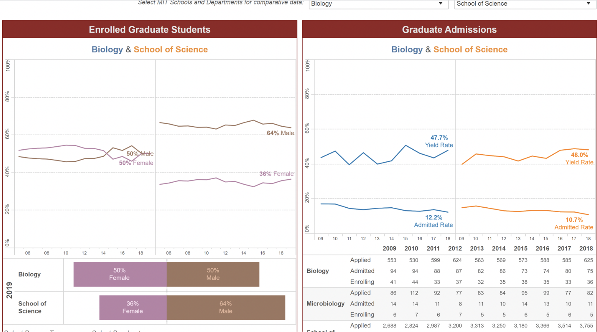

### 基本背景

> GPA: 3.81/4 (rank 1/19)
>
> TOEFL: 98 and 105(第二次考出来这个成绩，只有少数学校使用)
>
> GRE: 155V+170Q+3W
>
> MIT学期交流
>
> 两篇SCI一区, 其中一篇一作
>
> 联系方式：644565983（QQ）

### 申请结果

> Offer
>
> [PhD in Mechanical Engineering @ Boston University] (accepted)
>
> [PhD in Mechanical Engineering @University of Minnesota]
>
> [PhD in Mechanobiology Institute @ National University of Singapore]
>
> [MS in Mechanical Engineering @ John Hopkins University]
>
> Rej
>
> [PhD in Bioengineering @ UC San Diego]
>
> [PhD in Bioengineering @ UC Berkley]
>
> [PhD in Mechanical Engineering @ MIT]
>
> [PhD in Engineering and Applied Sciences @ Harvard University]
>
> [PhD in Macromolecular Science and Engineering @ Michigan Engineering] (interviewed)
>
> [PhD in Material Science and Engineering @ UC San Diego]
>
> [PhD in Biomedical Engineering @ Brown University] (interviewed)
>
> [PhD in Material Science and Engineering @ Northwestern University]
>
> [PhD in Mechanical Engineering @ University of Pennsylvania]
>
> [PhD in Biomedical Engineering @ Tufts University]
>
> [PhD in Biomedical Engineering @ Worchester Polytechnic Institute]
>
> Unknown
>
> [PhD in Biomedical Engineering @ The Hongkong Polytechnic University]

### 导语

我申请过程中的一些心得体会其实在前一阵的生医工系公众号推送（[https://mp.weixin.qq.com/s/g9oPMa2dWBFt-GuB1SsdCQ](https://mp.weixin.qq.com/s/g9oPMa2dWBFt-GuB1SsdCQ)）中也说过了，包括MIT给的PS以及CV如何写作技巧链接等。另外请大家申请前务必查看由数学系徐源诚学长为大家介绍的整个申请流程框架结构等一系列general问题（[https://sustech-application.github.io/2020-Fall/#/grad-application/math/applied-mathematics/[US]-16-xuyuancheng](https://sustech-application.github.io/2020-Fall/#/grad-application/math/applied-mathematics/[US]-16-xuyuancheng)）。因此我这里也就结合自己的申请结果当做案例分析了。    

首先可以看到的是我申请了很多很多很多很多很多学校，也抱着中彩票的心态吧。最后结果也可以看出，拒我的有好有差，收我的，也有好有差。所以大家不要怕不敢申好学校，如果恰好碰上哪个比较match的老师就有可能收到反套，这时候才是关键！如何套磁请见计算机系谢丹宁学姐的分享([https://sustech-application.github.io/2020-Fall/#/grad-application/computer-science-and-engineering/[US]-15-xiedanning](https://sustech-application.github.io/2020-Fall/#/grad-application/computer-science-and-engineering/[US]-15-xiedanning))

很好相信大家已经看出来了我比较喜欢从歪门邪道收集资源了。这里我顺便也说说如何深度挖掘信息吧。

### 经验分享

I． 选学校/项目

​    i. 地理位置：想好自己的大方向（计算机在加州、生物医疗则波士顿），这直接决定了你在博士期间以及毕业之后身边的资源，毕竟老师也喜欢与邻近实验室合作项目。仔细点的话知乎有着各种学校的生活体验以及交通便利程度等。

​    ii. 排名: 美国学校一般都看US NEWS，综合排名是给本科生看的，研究生主要看专业的单项排名。

​    iii. admission statistic/data: 歪门邪道中的旁门左道，很多学校不管你进入工学院哪个department/program，选导师都可以在工学院内任意选。这个信息直接决定了你并不需要进入到最好也是最难进的项目就能享受到同样的资源以及老师。因此学校官网直接搜索admission statistic，学校会显示近年来的录取率，国际生比例，男女比等。

给大家拿MIT的举个例子，我选了下biology department，这里便显示出历年男女、录取比例等其他信息我就没截图了。

像这样的表单能告诉我们什么呢，就是说如果这个program录取人数每年都很低的话就说明很难录取，国际生比例少可能是他们在资金上有限制（国际生很多奖学金没法申请），女生比例少他们为了diversity可能对女生有照顾之类的。需要注意的是，这里的graduate students包括了研究生和PhD。

少数学校没有这样的表单（例如波士顿大学），不过通过各项目的US NEWS排名也能看出申请的难易程度。 

II. 选导师

​	i. bio: 学校官网的老师主页，推测老师毕业年份，既可以让自己在看他的citation时有个心理预估也可以帮助判断其expectation。刚起步的老师一般会想要很多产出，比较push，厉害的老师（自己结合citation感受）能让自己在PhD阶段收获很多。步入教职很久的老师可能已经拿到了tenure，大佬级别，如果不是特别match还挺难套的，好处是他们已经是一个领域的领军人物，过的是不是更清闲我不知道，项目前沿break the boundary是一定的。自行把握想找的老师吧。

​	另外如果是中国人bio还能告诉你他什么时候来到的国外。

​    ii. citation, H-index, i-10 index: 直接搜名字加google scholar（需翻墙）, citation要结合bio一起看，刚刚起步的可能citation确实不多，这时候看看H-index与i-10 index，文章质量高的也很厉害。

​    iii. connection: 近期publication。 是否和以前的老板（结合bio）有合作，有合作的话自己入了它的组便也可能多一份大佬资源。和外校是否有合作，国际上还是附近公司/医院。

​    iv. industrialization/purely academic：官网介绍或者lab website中一般会写，或者自己感受其科研方向有没有可能步入社会实际应用。想好自己长远的方向找老师。

​    v. group members: lab website中。看看集体照，比如我看到活泼一点的就会心理上倾向觉得这个组比较轻松。都是外国人或者都是亚洲人的情况就会有些复杂（纯客观陈述，不带有任何偏见色彩，具体情况需要多方面分析，反正可以留意一下）。

​    vi. 资金状况：grantome[https://grantome.com/](https://grantome.com/)_，the entirety of funding information。有钱的老师成功率更大呀。 

### 个人案例分析 

我印象深的几个学校：

Brown BME一定要套磁！之后才有可能入committee的法眼，

MIT MechE强committee，

UMich可套磁，

NUS(MBI)很友好，

明尼苏达大学committee，

HK Poly U导师主导，

BU地理位置好呀 钱多呀 committee

（等我有空继续补，希望大家多催催我）