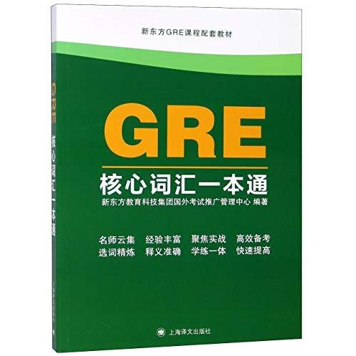

# [US]-17-艾谦-PhD @ UIUC

## 基本背景

>专业：材料科学与工程
>
>GPA：3.85. 
>
>排名：6/55
>
>托福：111（R: 30 L: 30 S: 24 W: 27）
>
>雅思：7.5（R: 8 L: 8.5 S: 6.5 W: 7）
>
>GRE：327+4（V: 158 Q: 169）
>
>论文：申请时有两篇挂名（6作和5作）文章在投。
>
>其他：前往麻省理工学院交流一年（大三；GPA：5/5）

## 申请结果

PhD: Berkeley（rej）、Northwestern（rej）、UIUC（offer，最后选择了UIUC）、UBC（教授微信来了解情况，我说有美国就不考虑加拿大）、Boston University（offer）、TAMU（offer）、CMU（rej）、Georgia Tech（很晚告诉我在waitlist，我就退了waitlist）、UT Austin（有教授联系我，我说有了BU就不考虑了）、UCSB（rej）、University of Minnesota (offer)、Virginia Tech（教授zoom问我情况，我说可能不会去）、University of Washington（叫我参加宣讲会我没有去）

Ms: EPFL（rej，感觉是GPA排名太低）、MIT（rej，申了机械和材料都拒了）

## 申请心得

我会把我对于每一块的自己的经历和建议放在一起说

### 申请PhD主要需要什么

科研，GPA，推荐信，英语

#### 科研

我从大二开始就进入了徐保民教授的实验室，当时给我安排了一个博后师兄带我，他教了我很多，从做实验的操作到宏观的怎么做科研。由于我大三都在MIT交流，所以我之前和之后的是分开的，导致到毕业也没有一篇独立的文章。大二一年基本上都在练习实验操作，尝试理解我做实验为什么要这么做，缺少这一步会怎么样，太阳能电池怎么工作等等一系列基础问题。由于电池的生产流程很长，一做就是一天，而且往往连续做好几批才能发现规律，所以基本上只有寒假暑假才能好好的进行一些探索，我在大三暑假回到学校之后就开始独立的进行一些对自己idea的探索，大部分工作也是在暑假里完成的。

所以我建议学弟学妹学期中可以安心上好课，等到寒暑假抽一段整块的时间再系统性做一些科研。这样效率反而更高。另外最好能够多看文章，然后独立的做些工作，可以更好的锻炼科研能力。或者在探索其他人的idea的时候多想想为什么他会这么想，每一次实验都想想这次想得到什么结论，保持自己一直在思考，不要盲目操作。

 

另外看文章其实是最重要的，有时候根本没必要做实验，并且有的研究根本不需要做实验，所以大家可以不用着急，多看论文。我现在来美国读博第一年，基本上所有时间都在看论文。你首先要理解你组里的师兄师姐在做什么，这个方向的其他人在做什么，才能好好开始研究，所以不用急于做实验。

另外对于本科生，特别是大二大三的本科生，看不懂论文特别正常，特别是大部分论文都是英文。基本上很少有人能够一上来能够就可以顺利地流畅地看懂。这是一个过程，不用着急。但是不能不看，因为如果你想读研究生这是一项必备的技能，你想出国的话，英语也是必备的技能。所以看 paper的时候最好不要把它翻译成中文。其实某一个领域的研究常说的词也就那么些词，你多看一点把那些词记一下，你就大概能够看明白了。

另外，科研论文一开始可以不用看太细。因为细节基本看不懂。基本上找到一篇文章，你就看一下摘要和结论就可以了，要是特别感兴趣，或者跟你的研究特别相关，你就可以仔细看一下，但大部分文章可以浏览就行。

可以请组里高年级的师兄师姐发你几篇论文，这样可以事半功倍。一般他们都会叫你总综述开始读，但是综述读起来，很容易让人看了后面忘了前面，所以尽量选短一点的语言简洁一点的综述开始看。

刚开始看论文的时候可以主要看看实验部分和表征部分，因为这两部分是你看得懂的。你可以看看比如说别人是用什么样的方法加工成的材料，看看别人是用什么表征，然后查一查这种表征的基本原理。这样你可能看不懂那些深奥的理论，但是你可以知道别人在做什么，慢慢的也就明白了。

在看完很多篇论文，并且大概对这个领域有一个了解了之后你就可以想一下，你可以做什么，然后和师兄或者导师讨论一下之后，你就可以开始自己的实验了，这个过程最好独立进行，这样能学到很多东西，虽然你的想法大概率不是一个很好的Idea。
 

 

#### GPA

理论上讲是越高越好，但感觉3.8以上就没有什么区别了。申的时候如果排名好可以写，不好可以不用写。GPA他们会结合你的学校看，有可能你GPA3.81，但是他们收到5个SUSTech的申请者其中你是最低的，那你可能很早被pass了，所以在申请的时候可以和系里同学错开学校申请，比如你申UCSD，他申UCSB。

#### 推荐信

推荐信可以说是最重要的一个部分，一般要3封。我当时去MIT交流找了3个老师给我写，加上南科大的导师徐老师，一共有四封，申请的时候可以4选3的提交。在MIT我选了一门课做了一个项目，做的指导老师很满意，她给了我一个强推。另外徐老师的也是强推，所以这两封是每个学校都提交了。另外两封是课程的推荐信。博士申请主要看的是科研能力，所以最好是带过科研的老师写，上课的推荐信可以反映你的学习能力，也行。

推荐信是越详细越好，写的人是哪种professor并不重要，（除非那个人真的业内很有名）。

南科大的同学可以找学术导师写一个；找上专业课的某个老师，多交流，然后写一个；再找出去交流的国外的老师写一个或者混过的另一个实验室老师写一个或者另一个上课的老师写一个。

#### 英语

我托福考了3次，分别是102, 103, 111，其实第一次的大部分学校都够用了，但是我对托福有个执念，就想上110。雅思在美国的时候也考过，7.5分，当时想申MIT Media Lab，他只收雅思，后来也没有申。GRE在去美国之前考了327，就再也没有管过。一般中国学生口语写作会比较低，所以要好好准备口语。口语最好在24以上，因为很多学校当TA的标准是这个，另外有些学校会卡口语小分。

托福我写过一篇[经验分享](https://zhuanlan.zhihu.com/p/336296223)，基本上想说的都在上面了。大致就需要背单词＋刷题。背单词很重要，很多时候阅读上不去就是单词不熟。完全没有必要报班，主要还是自己练习，总结自己的规律，而且南科大也有TOFEL preparation的课。

GRE需要准备挺久的，因为单词太多了最好在一个月到两个月之间。建议先背完这本书上的词，然后就可以边背边刷题了。最好抽一整段时间准备GRE。我在大二暑假就是一边做实验一边GRE，有点累

### 具体要提交哪些文件

CV，成绩单，推荐信，SOP，个人信息，其他

 

#### 建议

大家本科还是需要把基础课程都学好，把基本概念搞明白，最基本的定理自己推一边。多想想定义和定理为什么要这么定义，这些符号都代表了什么真的非常重要。有时候多做的一些题，其实都没有那么重要，最重要的是最基本的东西。最基本的公式和模型自己推几遍这个对之后非常有帮助。因为之后做的东西都没有标准答案了，你需要很多东西需要自己推导。因为你如果要读博期间的研究肯定不能是空中楼阁，他的基础都是你之前或者正在学的这些。

比如我现在上哪一门分子学模拟的课程，涉及到很多统计学的知识，我是在大二的时候学的概率论与数理统计，所以记得不是很清楚，最近还花了很长时间复习，所以大家一个是需要在上课的时候把课程上好基本概念搞明白，（比如随机变量的方差和数理统计里样本的方差是两个不一样的东西）。另外要把课程的资料保存好，以后都会有用的。我最近发现我的课件没有下完，后来尝试登录了一下sakai发现居然还能上去，所以我就重新下了一遍。

另外就是英语方面，如果你想出国读研究生英语是特别重要的。但是适应需要有一个过程，我当时去麻省理工交换了一年，走的时候都和别人说话都还有很多地方只能靠猜，基本上无法正常和别人交流。直到我现在来了uiuc才感觉听力和口语进步了很多，基本上能和人正常交流了。

其实最重要的还是听力，你不知道别人在说什么是没有办法交流的，你听懂了，别人在说什么之后你想说什么怎么着也能蹦出几个单词，再加上一点手势别人大概就明白了，所以听力练好很重要。大家在国内可以多看看美剧不要字幕，这样到国外适应的会快一点。

在说英语的时候自信很重要，我之前很多时候说话美国人听不懂，就是因为声音不够大，所以我现在说话不论说什么都比较大声，不管是对是错。但你大声地和别人交流一段时间之后，你自己自信也会提升很多，这是一个良性循环的过程。

 

 
