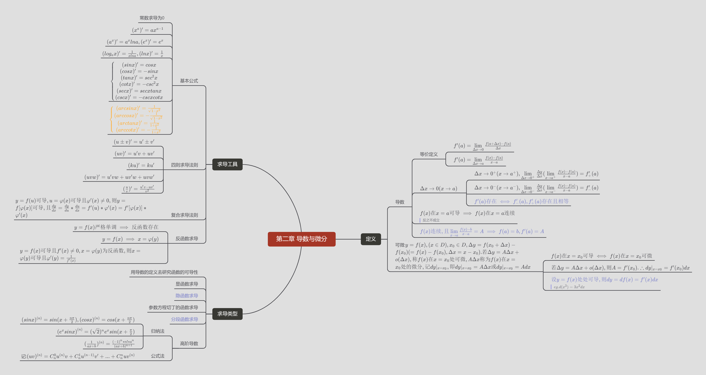

# 南方科技大学计算机系考研攻略

在考研之前，一定要先决定好为什么考研，目标不够强烈，很难坚持到最后。

不要跟风考研，时间和精力要花费得有意义。

### 一. 选专业

并不是所有的同学都喜欢自己本科的专业，跨考也是一种常规操作，决定考研需要目标，选择专业则需要理智。跨考看起来是一个换专业的好机会，但同时也意味着重新学习专业课，以及在考研复试时可能会很困难

### 二. 择校

#### 1. 专硕和学硕

学硕：侧重于理论学习，以发paper为目标，可以直博，学费较低（和保研差不多）。考研难度相对较大，可以调剂至专硕，学制3年

专硕：侧重于案例分析和实践操作，以就业和实习为目标，部分不允许直博，需要考博，学费略贵。考研难度要小一些，除少数专业，通常只能在专硕间调剂，学制2-3年

简而言之学硕是培养科学家，专硕是培养研究生学历的人才

不读博的话二者没有区别，有时候专硕在找工作上反而比学硕跟占优势

总体趋势：专硕增加学硕减少，要考学硕要抓紧

#### 2. 全日制、非全日制

全日制研究生：和全日制本科生一样，在学校上课学习

非全日制研究生：周末上学或者集中学习，一般不提供住宿、奖学金。大多是专硕。

上二者法律地位相同，属于双证学历教育统招研究生

在职研究生：不同于非全日制研究生，以在职人员身份，不脱产或者半脱产学习。考察难度最小，社会认可度正在上升。

#### 3. 定向、非定向

非定向：毕业后自由择业

定向：国家计划内定向培养，培养费用由中央或地方财政拨款，录取前考生工作单位、录取学校、考生本人三方签署定向培养协议。档案、人事、户口、工资关系仍留在原工作单位，考生毕业后回原单位工作。比如非全日制研究生，大部分属于定向培养方式，一般不享受奖学金和其他生活待遇。

很多非全日制只招收“定向培养”

#### 4. 分数线

自划线：有34所自画线学校，会在国家线出来之前自己画出校线，选择了这些学校的同学需要关注

\1. 国家线：国家画一条线，不同学科不一样（本校计算机系属于工学，2022年国家线工学线为273分）。国家线有A、B区的区别，A区通常高5分。注意：A、B区是指你所报考的学校是否在该区

\2. 单科线：公共课或专业课的国家线，也就是数学、英语、政治、专业课的最低录取线。总分和单科线都过了，才可以参加调剂

\3. 校线：划出国家线后学校会划出校线，过了校线就可以申请校内调剂，即你所报考的专业没有录取你，你还可以在校内调剂到其他专业

\4. 专业线：各个专业根据报考人数在校线上划出一条专业线，过了该条线才可以参加专业复试。

通常我们说的学校分数线是指去年该学校的校线，专业分数线是指去年该专业的专业线，这两条线每年会酌情变化

专业线>校线>国家线

#### 5. 择校标准

择校的标准因人而异，列举几个作为参考

l 想要投入科研：查看各个学校在科研力量上的投入；查看QS排名等

l 专业：不同学校的王牌专业不一样，根据自己想要选的专业排名选择学校也是一个很好的做法

l 想要找工作：985，211（虽然国家说不论这个，但是各个公司还是看的这个），双一流等企业常见的量化标准；如果有心仪的公司，考该公司本地附近的学校也不错，比如想去腾讯，华为，可以考本校

l 工作地点：有人想回到家乡发展，可以选择家乡附近的大学

l 难度：考研不是一个简单的任务，做过考研真题的同学会发现，十几年前的题目基本上直接套公式就可以做，但是近几年却可以玩出花来，选择一个分数线低的学校会更容易成功，可以通过报录比判断

l 专硕、学硕：部分学校部分专业只招学硕，部分只招专硕；如果是希望有研究生学历可以方便找工作，建议专硕

l 学制：不同类型的研究生，就读的时间不尽相同，有些同学想要快点工作，选2年学制的学校比较合适

l 黑名单：部分学校会有一些引人非议的操作，每年都有人中招，可以关注一下相关的信息，避免踩坑

### 三. 备考

不同学科考研科目不相同，具体如何安排复习要根据个人情况调整。南方科技大学计算机系的考研科目是数学（一），英语（一），政治（一），统考408

 

一些关键时间节点：

| 10月 | 11月 | 12月         | 1月  | 2月      | 3月  | 4月  | 5月  | 6月  | 7月  | 8月  | 9月            | 10月     | 11月                 | 12月         | 1月  | 2月      | 3月  | 4月  |
| ---- | ---- | ------------ | ---- | -------- | ---- | ---- | ---- | ---- | ---- | ---- | -------------- | -------- | -------------------- | ------------ | ---- | -------- | ---- | ---- |
|      |      |              |      |          |      | 调剂 |      |      |      |      |                | 开始报名 | 网上确认（现场确认） |              |      |          |      | 调剂 |
|      |      |              |      |          |      |      |      |      |      |      | 大纲公布       |          |                      | 打印准考证   |      |          |      |      |
|      |      | 初试（两天） |      | 公布成绩 | 复试 |      |      |      |      |      | 咨询周，预报名 | 结束报名 |                      | 初试（两天） |      | 公布成绩 | 复试 |      |

每年考研通常是12月最后一个周末

通常考研机构建议“大三开始备考考研”指的是上表中10月，考研时间在大四上学期期末之前，也就是来年12月，复试则在大四下学期，也就是再过一年的三月，录取后，在7月大学毕业，9月研究生入学

但是该时间并不是绝对的，毕业后也可以考研

 

8-10月，各个院校公布招生简章和专业目录

9月中上旬公布考试大纲，但是不可以等到这时候才开始复习，在此之前应该以去年的考试大纲学习，这时候再补充学习大纲新增知识点

9月中下旬开放网上咨询，但是除了极少数很优秀的学校，绝大多数学校的咨询不会有任何结果

9月还会公布一些其他的报考注意事项，包括是否可以跨省参加考试一类的问题，需要关注研招网公告

预报名与正式报名同样有效，但部分省份不允许往届生预报名（如果可以预报名，一定要预报名，可以及时收到信息是否出错的通知。每年都有报名信息错误导致报名失败的案例）

正式报名：注意缴费是否成功

现场确认（网上确认）：确认信息是否正确，需要：三月内电子证件照，本人身份证（网上确认还需要本人手持身份证照）等，建议提前准备

打印准考证：在研招网下载电子版准考证自行打印。电子版做好存档，复试可能会用到

 

 

建议采取行动的时间节点：

 

 

| 10月             | 11月 | 12月         | 1月  | 2月      | 3月                                    | 4月  | 5月  | 6月  | 7月                | 8月                | 9月            | 10月                         | 11月                 | 12月                         | 1月  | 2月      | 3月  | 4月  |
| ---------------- | ---- | ------------ | ---- | -------- | -------------------------------------- | ---- | ---- | ---- | ------------------ | ------------------ | -------------- | ---------------------------- | -------------------- | ---------------------------- | ---- | -------- | ---- | ---- |
| 建议开始备考时间 |      |              |      |          | 实际上和你竞争的大多数人开始备考的时间 | 调剂 |      |      | 专硕大多这时候入场 | 再不备考就来不及了 |                | 开始报名（有一大堆材料要交） | 网上确认（现场确认） |                              |      |          |      | 调剂 |
|                  |      |              |      |          |                                        |      |      |      |                    |                    | 大纲公布       |                              |                      | 打印准考证                   |      |          |      |      |
|                  |      | 初始（两天） |      | 公布成绩 | 复试                                   |      |      |      |                    |                    | 咨询周，预报名 | 结束报名                     |                      | 初试（你要参加的那一场考研） |      | 公布成绩 | 复试 |      |

 

简单小技巧：

**考研政治**：每年都有押题，有的时候押题很准确，但是不可偏听偏信。背押题卷最主要的不是指望押题，而是积累词汇库，具体考试时使用抄材料大法（见B站up主的分享，这里分享一个很好的：[材料分析题｜不背书只抄材料的方法——以肖四（一）35-1为例_哔哩哔哩_bilibili](https://www.bilibili.com/video/BV16M4y1c7Df?spm_id_from=333.1007.top_right_bar_window_custom_collection.content.click)）。考研政治一般在八九月份开始备考

**考研英语**：主要是背单词（考研词汇5500左右），拿着一本考研词汇闪过顺着背，差不多背到一千多快两千词（甚至只要求会认就行，不一定要会写）就可以读懂考研英语上绝大多数内容了。然后刷往年真题练习题感（读懂文章不会做题在考研里实在是太正常了，还有不要刷模拟题，没有用）。除此以外，考研作文要提前准备模板，一大一小两篇作文，自己提前了解（不要相信某些机构的作文押题，每年都说押题押中了作文主题词，实则每年都给一两百个单词，用来测验模板好不好用还行）。其他题目会有很多讲得天花乱坠的视频，然而解题方法其实过拟合了，再巧妙也只适用于那一题，不推荐。考研英语因为要背单词，建议每天背。

**考研专业课**：计算机系考研专业课为408，内容为数据结构与算法，计算机组成原理，操作系统，计算机网络。其中计算机网络考察内容最简单，计算机考察内容最难。有一道手写代码题，要求用C/C++。不熟悉这两种语言的同学不用害怕，不会考察很难的语法内容，不用java是要制止投机取巧而不是为了刁难人。只做往年真题不看书都可以拿到八九十分，但是想要突破一百、一百一，需要精读课本。考研计算机根据自己的基础决定备考时间，但是一定要刷真题。

**考研数学**：上面的科目很难拉出差距，但是考研数学可以。考研数学有三个科目：高等数学，线性代数，概率论与统计。本校高数并没有应试训练所以本校同学可能会有些吃亏，需要自己找材料自学。线性代数和概率论其实很简单，前者题型基本固定了，后者需要背诵的内容大于计算。实际上备战考研大多数时间都是用在考研数学的学习中。

没有参与过考研的同学可能不太好调节自己的复习进度，可以在网上看看其他人的建议自行拟定计划。注：不要在政治上花太多时间。

### 四. 报名

提前注册好学信网账号（与研招网互通）

材料：身份证，学生证（应届生），毕业证、学位证证书编号（往届生），档案所在地信息

流程：登录[研招网](yz.chsi.com.cn/)->注册并登录->点击网上报名->填写信息（注意：毕业证和学位证号码不一样别弄反了）

往届生：其他人员

应届生：应届生（还没毕业）

在职考生：其他在职人员/其他人员

 

报名后在自己报考点附近就近预定旅馆（就是你参加考试的敌方，如果是应届生且自己的学校也是考点，就报在本校）

 

网上确认/现场确认

个人证件照：会用在准考证上。要求：本人近三个月内正面、免冠、无妆、彩色头像电子证件照（蓝色或白色背景，具体以报考点要求为准）；脸部无遮挡，头发不得遮挡脸部、眼睛、眉毛、耳朵或造成阴影，要露出五官；不得化妆，不得佩戴眼镜、隐形眼镜、美瞳拍照等

身份证正反面

手持身份证照片

 

缴费成功才算报名成功

记录一下报名号

 

十二月中旬可以在研招网打印准考证

### 五. 初试

通常为12月最后一个周末，注意中午是14：00开考，哪怕就近预定旅馆，中午恐怕也无法午休

第一天：

8：30-11：30 政治

14：00-17：00 英语

第二天：

8：30-11：30 业务课一（通常为数学）

14：00-17：00 业务课二（本校为408）

特殊科目会考第三天

### 六. 复试

二月中下旬出成绩，三月中出国家线。国家线通常不会变化太多，扩招线下调，人多线上升。各个学校复试不一样，通常要一个英文自我介绍。

### 七．附件

附件仅供参考

 

 

高数版

